# Day 001 — Lockdown Lab

| | |
|---|---|
| Plateforme | [CyberDefenders](https://cyberdefenders.org/blueteam-ctf-challenges/lockdown/) |
| Catégorie | Network Forensics |
| Difficulté | Easy |
| Date | 2026-08-11 |
| Outils | Wireshark / tshark, capinfos, Volatility 3, FLOSS / strings, VirusTotal |

Ce lab est encore actif, et CyberDefenders interdit la publication de writeups pour les labs actifs. Ce document décrit donc uniquement la démarche — les filtres, les outils, le raisonnement — et les réponses sont masquées, dans le texte comme dans les captures (floutées). L'idée est de partager la méthode, pas les solutions.

## Contexte

Le SOC de TechNova Systems a repéré du trafic sortant suspect depuis un serveur IIS exposé sur Internet, ce qui évoque le dépôt d'un web-shell et des connexions vers un hôte inconnu. Trois artefacts sont fournis :

| Artefact | Type | Ce qu'il apporte |
|---|---|---|
| `capture.pcapng` | Trafic réseau (~3,8 Mo) | Ce qui a circulé sur le réseau |
| `memdump.mem` | Image mémoire (~4,7 Go) | L'état du serveur pendant l'attaque |
| `updatenow.exe` | Malware (~588 Ko) | Le binaire récupéré sur le disque |

L'objectif est de reconstruire l'intrusion de bout en bout et de la relier à MITRE ATT&CK. La chaîne se lit ainsi :

```
reconnaissance (scan)  ->  énumération HTTP  ->  accès SMB
   ->  dépôt d'un web-shell  ->  reverse shell
   ->  persistance  ->  command & control (RAT)
```

## Analyse du PCAP

### Survol

Avant de chercher quoi que ce soit, un coup d'œil global pour cartographier le trafic :

```powershell
capinfos capture.pcapng
tshark -r capture.pcapng -q -z io,phs
```

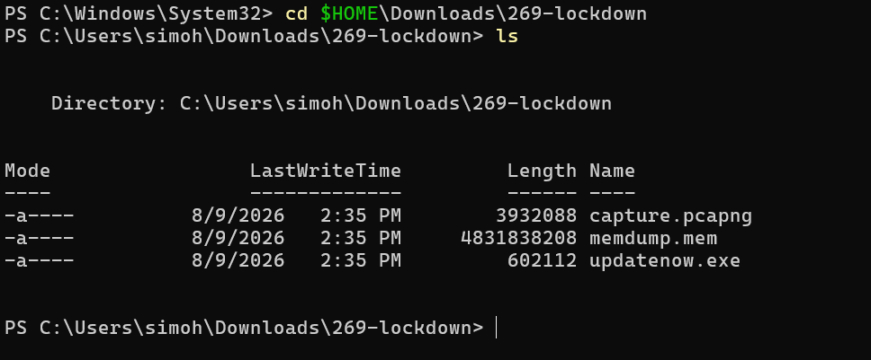
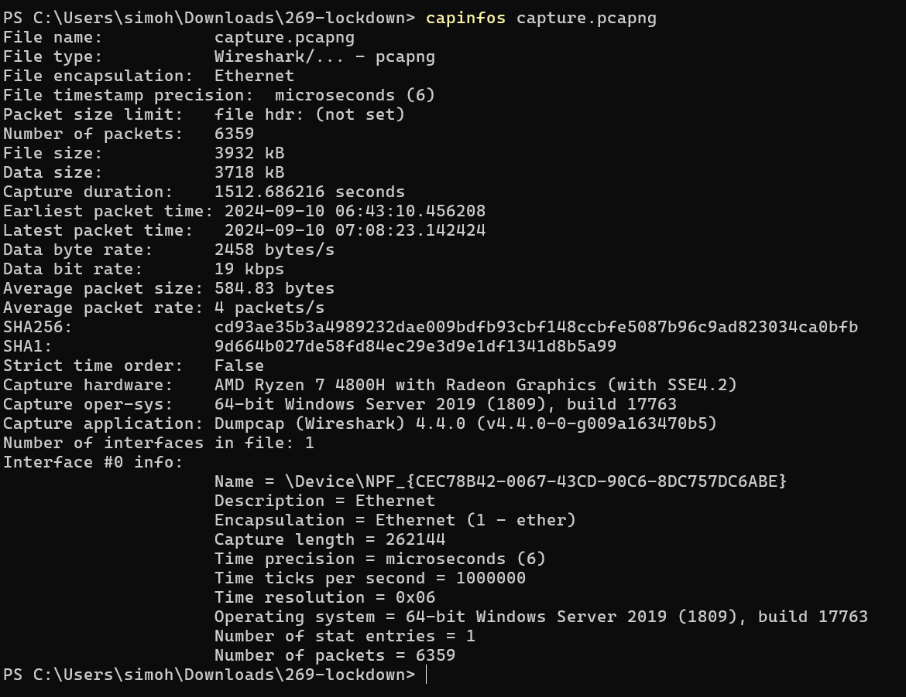

La hiérarchie des protocoles montre du TCP dominant, du HTTP, du SMB2, du DNS, et surtout un gros volume de `data` TCP brut — signe probable d'un canal de reverse shell.

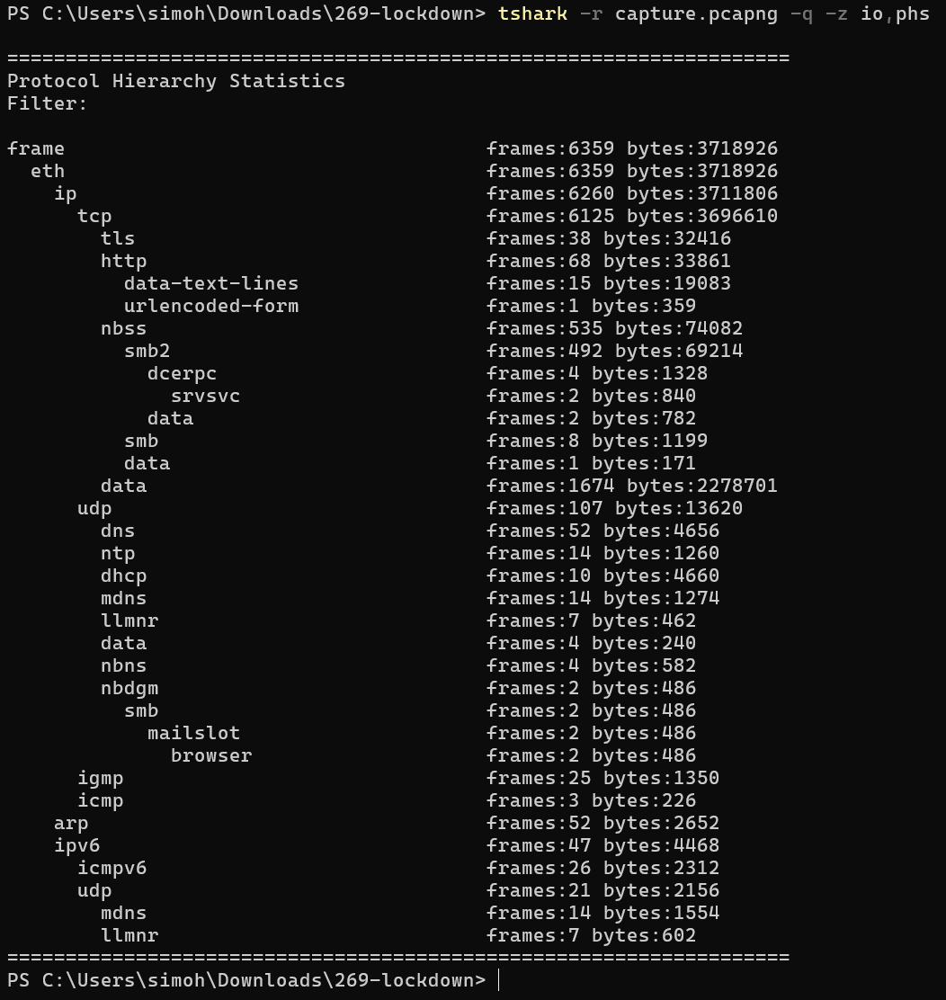

### Q1 — IP à l'origine de la reconnaissance

Un scan de ports se traduit par une IP qui ouvre énormément de connexions TCP vers des ports variés. Dans `Statistics → Conversations → IPv4`, une paire d'IP écrase toutes les autres en nombre de paquets.

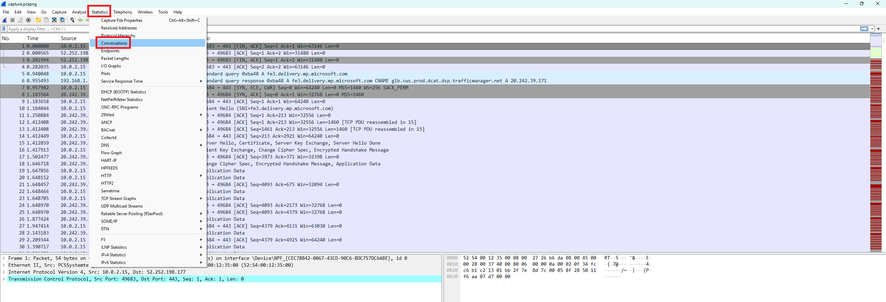
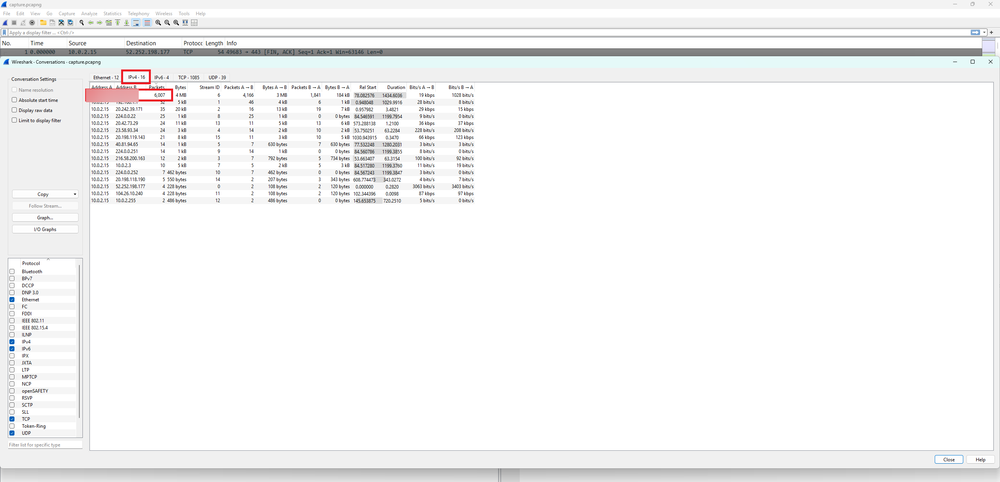

`Statistics → Endpoints` confirme : l'IP attaquante domine largement en paquets émis (Tx Packets).

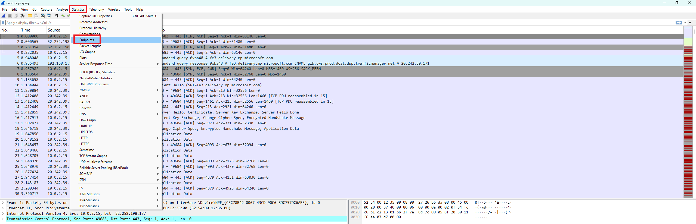
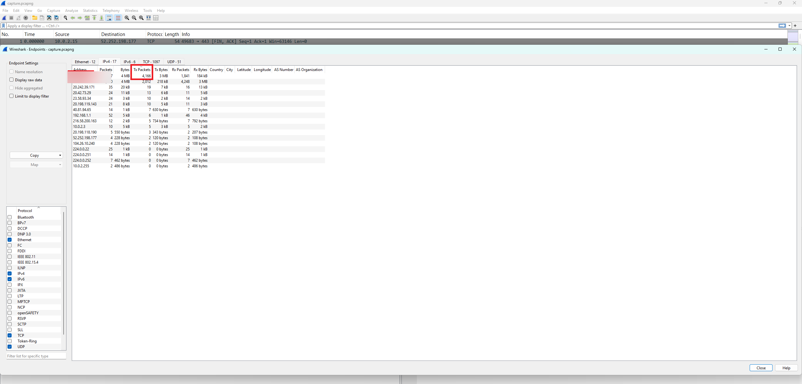

ATT&CK T1046 (Network Service Discovery).

### Q2 — Outil d'énumération HTTP

Les outils d'énumération laissent leur signature dans le `User-Agent`. On filtre `http.request`, puis clic droit sur le champ User-Agent → Apply as Column pour voir le motif sur toutes les requêtes.

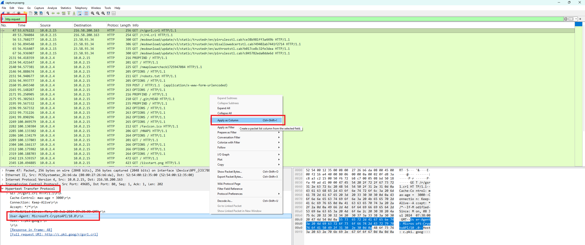

Un User-Agent d'outil offensif ressort, accompagné d'un motif de brute-force de répertoires (`/robots.txt`, `/.git/HEAD`, `/Documents/`…). Les premières lignes en `Microsoft-CryptoAPI` proviennent du serveur lui-même (vérification de certificats) : c'est du bruit légitime à écarter.

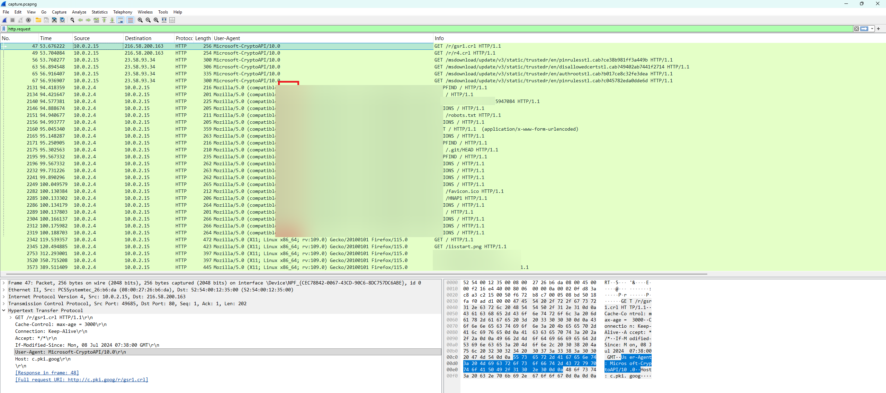

ATT&CK T1595 (Active Scanning).

### Q3 — Partages SMB explorés

Un « Tree Connect » correspond à l'ouverture d'un partage réseau. Le filtre :

```
smb2.cmd == 3
```

Les deux premiers Tree Connect Request de l'attaquant se lisent dans la colonne Info : un partage administratif caché, puis un partage cible.

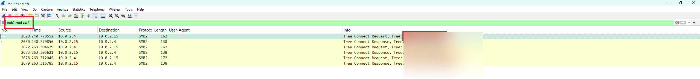

Le détail de la session SMB (NTLMSSP_AUTH, `NetShareEnumAll`, Tree Connect) confirme l'énumération.

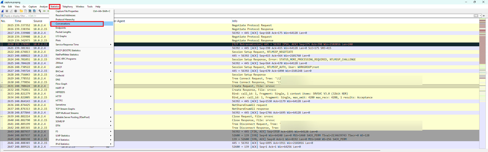

ATT&CK T1135 (Network Share Discovery).

### Q4 — Fichier malveillant déposé

Écrire un fichier via SMB2 correspond à l'opération « Create » :

```
smb2.cmd == 5
```

Parmi les fichiers manipulés (`srvsvc`, `<share>`…), un fichier avec une extension exécutable par IIS détonne : c'est le web-shell qui ouvrira l'exécution de code à distance.

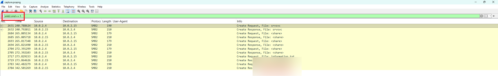

ATT&CK T1505.003 (Web Shell).

### Q5 — Port du reverse shell

Le web-shell fait rappeler le serveur vers l'attaquant, ce qui contourne le pare-feu. Dans `Statistics → Conversations → TCP`, en triant par Bytes, la plus grosse connexion part du serveur vers l'attaquant, sur un port peu commun mais qui passe facilement les pare-feux.

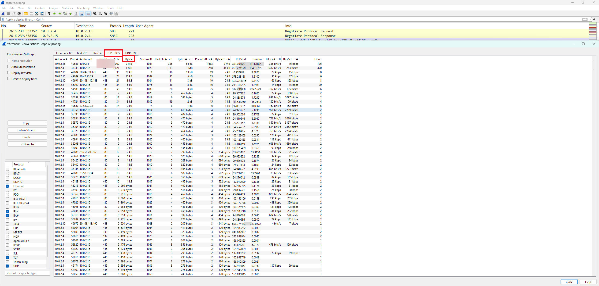

ATT&CK T1571 (Non-Standard Port).

## Analyse mémoire (Volatility 3)

### Q6 — Adresse de base du noyau

Étape de vérification : s'assurer que le dump est exploitable et identifier le système.

```powershell
vol -f memdump.mem windows.info
```

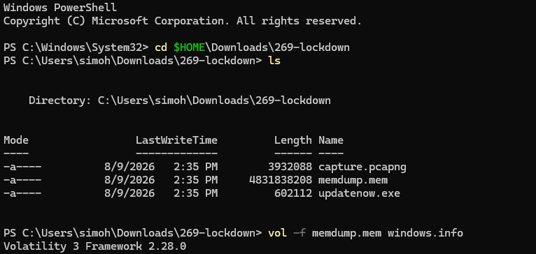

Le plugin confirme un Windows Server 2019 (build 17763, 64 bits, 4 CPU) et donne l'adresse de base du noyau.

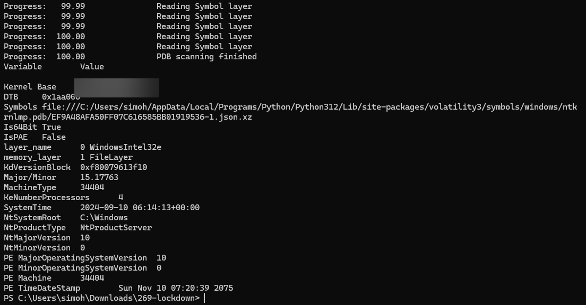

### Q7 — Exécutable de persistance

```powershell
vol -f memdump.mem windows.pstree
```

Un exécutable inhabituel apparaît, lancé depuis un emplacement de persistance (le dossier de démarrage), ce qui le fait se relancer à chaque redémarrage.

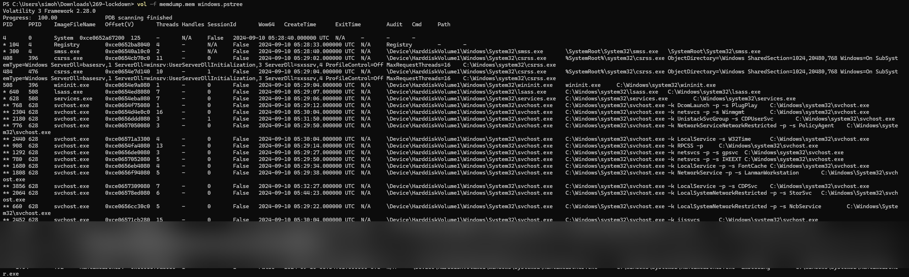

ATT&CK T1547.001 (Startup Folder).

### Q8 — Processus gérant le reverse shell

Dans l'arbre des processus, l'implant a pour parent le worker IIS, qui exécute aussi le web-shell : c'est le point de jonction entre le réseau et la mémoire.

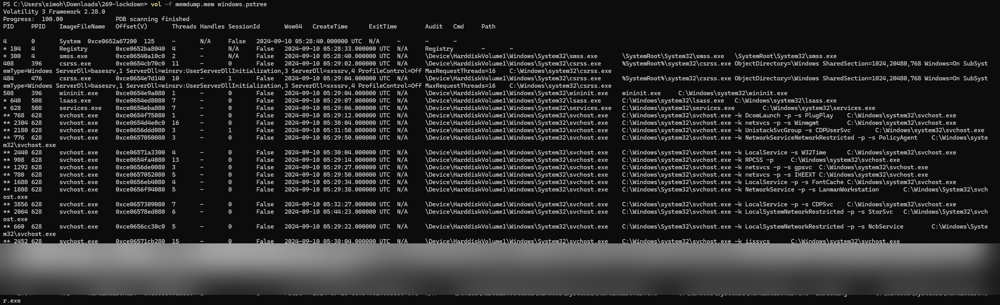

Le plugin réseau confirme que la connexion du reverse shell est détenue par ce même processus.

```powershell
vol -f memdump.mem windows.netscan | Select-String "<port>"
```

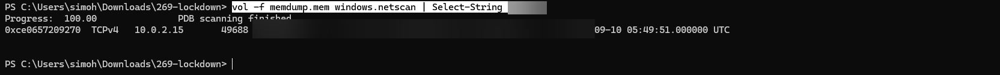

## Analyse du malware

### Q9 — Packer utilisé

Analyse statique des chaînes du binaire, à la recherche de signatures de packers connus :

```powershell
strings updatenow.exe | Select-String -Pattern "UPX|packer|PECompact|ASPack|Themida"
```

Les noms de sections trahissent un packer très répandu.

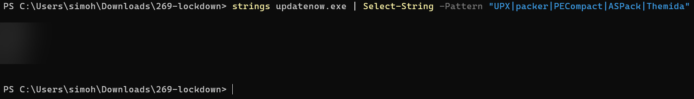

ATT&CK T1027.002 (Software Packing).

### Q10 — Serveur C2 (FQDN)

Les chaînes statiques (même après dépackage ou passage par FLOSS) ne révèlent pas le domaine, déchiffré uniquement à l'exécution. On pivote via VirusTotal → Relations → Contacted Domains : un seul domaine flaggé se distingue des domaines légitimes (Microsoft, Sectigo…).

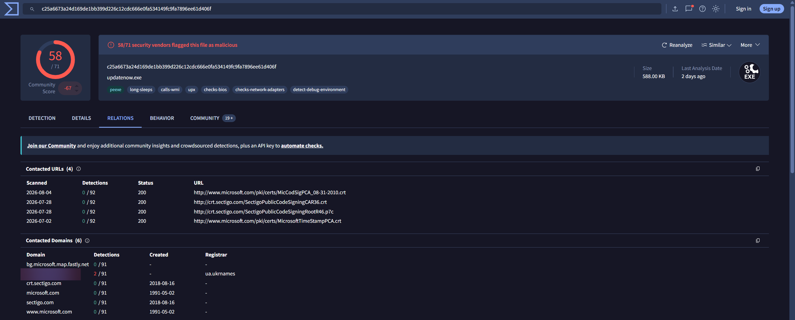

ATT&CK T1071.001 (Application Layer Protocol: Web Protocols).

### Q11 — Famille de malware

Sur VirusTotal, onglet Detection : la famille se repère au nom qui revient chez plusieurs éditeurs — un RAT / infostealer très répandu (keylogging, vol d'identifiants, exfiltration).

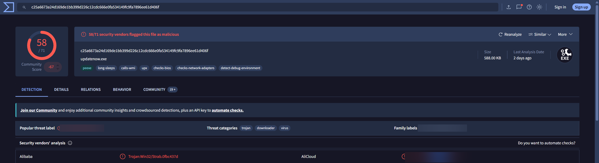

## Mapping MITRE ATT&CK

| Tactique | Techniques |
|---|---|
| Discovery | T1046, T1595, T1135 |
| Persistence | T1505.003 (Web Shell), T1547.001 (Startup Folder) |
| Defense Evasion | T1027.002 (Software Packing) |
| Command & Control | T1571 (Non-Standard Port), T1071.001 (Web Protocols) |

## Ce que je retiens

L'intérêt du lab tient à la corrélation de trois sources — réseau, mémoire, binaire — pour reconstituer une seule histoire. Le worker IIS (`w3wp`) est le fil rouge : il exécute le web-shell, porte le reverse shell et lance l'implant. Savoir écarter le bruit légitime (les vérifications de certificats Microsoft-CryptoAPI, par exemple) est tout aussi important que trouver l'indice malveillant.

## Côté défense

- Restreindre les droits d'écriture dans les répertoires web IIS pour empêcher le dépôt de web-shells.
- Segmenter le réseau et bloquer les connexions sortantes non nécessaires (le reverse shell).
- Surveiller le dossier de démarrage et les nouveaux services (persistance).
- Alerter sur les User-Agent d'outils offensifs et les scans de ports.

---

Réponses exactes non publiées tant que le lab est actif. Le writeup complet pourra l'être une fois le lab retiré.
