# Day 003 — DanaBot Lab

| | |
|---|---|
| Plateforme | [CyberDefenders](https://cyberdefenders.org/blueteam-ctf-challenges/danabot/) |
| Catégorie | Network Forensics |
| Difficulté | Easy — Retired |
| Date | 2026-08-13 |
| Outils | Wireshark, CyberChef, VirusTotal, ANY.RUN |

Lab retiré, donc les réponses sont incluses.

## Contexte

Le SOC a détecté une activité suspecte : une machine (`10.2.14.101`) a été compromise et des informations sensibles ont été volées. À partir d'un seul PCAP (`205-DanaBot.pcap`) et de la threat intelligence, l'objectif est de comprendre comment la brèche s'est produite.

L'infection suit un schéma classique de DanaBot : un script JavaScript sert d'accès initial, un processus Windows l'exécute, et ce script télécharge ensuite le vrai payload.

```
allegato_708.js (accès initial, servi par login.php)
   ->  exécuté par wscript.exe
   ->  télécharge resources.dll (le payload DanaBot) depuis soundata.top
```

## Analyse réseau

Le filtre `http.request` fait ressortir peu de trafic réellement suspect, une fois écarté le bruit Windows normal (SSDP/M-SEARCH, Microsoft-CryptoAPI, connecttest.txt). Deux téléchargements comptent : `login.php` (le premier dans le temps) et `resources.dll`.

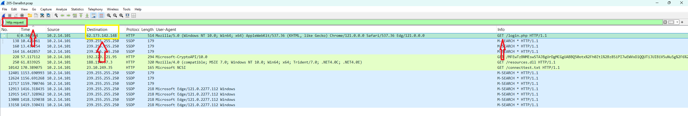

### Q1 — IP de l'accès initial

La toute première requête HTTP (paquet 6, `Time 0.34`) est `GET /login.php` vers `62.173.142.148`. C'est le point d'entrée : l'IP depuis laquelle la victime récupère le premier fichier.

**Réponse : `62.173.142.148`** — ATT&CK T1071.001 (Application Layer Protocol: Web).

### Q2 — Nom du fichier malveillant (accès initial)

Un clic droit sur la requête → Follow → HTTP Stream montre la réponse du serveur.

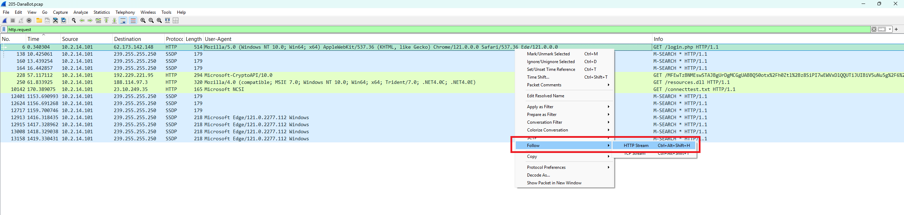

Le serveur renvoie un `Content-Type: application/octet-stream` (donc un fichier, pas une page) avec `Content-Disposition: attachment; filename=allegato_708.js`, suivi d'un gros bloc de JavaScript obfusqué (`_0x...`, `ActiveXObject`, `WScript`). `allegato` signifie « pièce jointe » en italien, cohérent avec l'`Accept-Language: it-IT` de la victime.

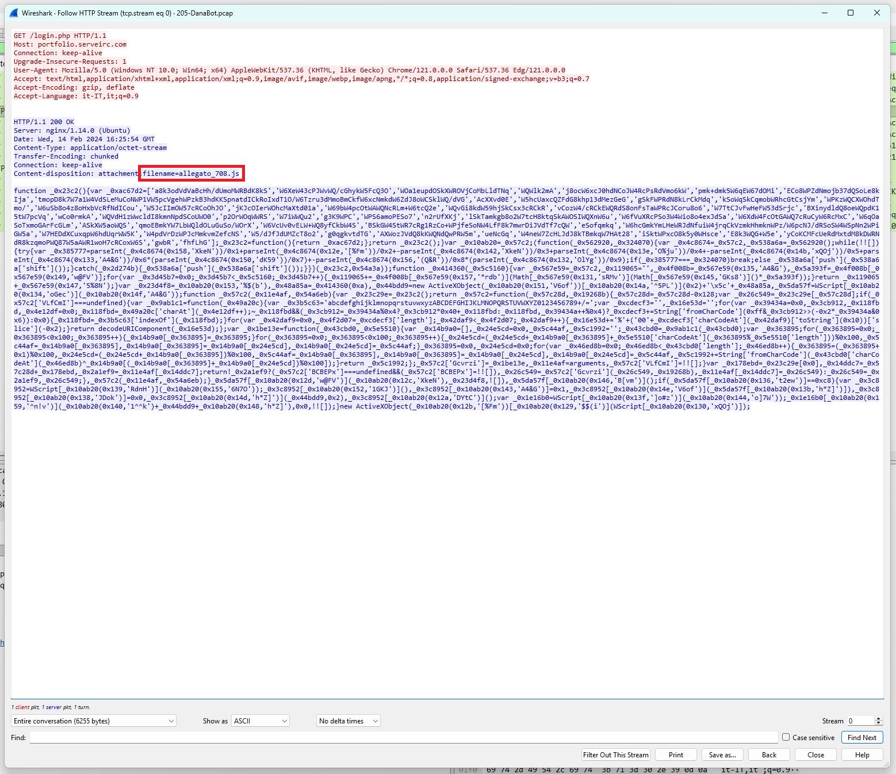

**Réponse : `allegato_708.js`**

### Q3 — SHA-256 du fichier d'accès initial

On extrait le fichier via `File → Export Objects → HTTP`.

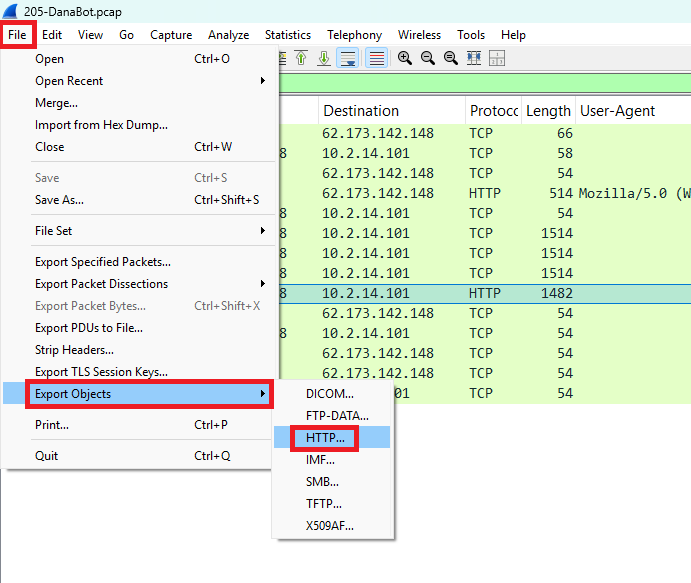
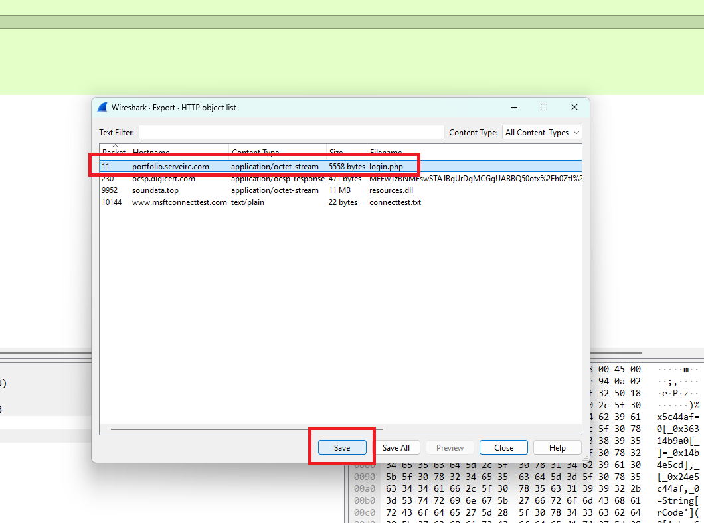

Puis on calcule son SHA-256 (ici avec CyberChef, mais `Get-FileHash` ou VirusTotal donnent le même résultat).

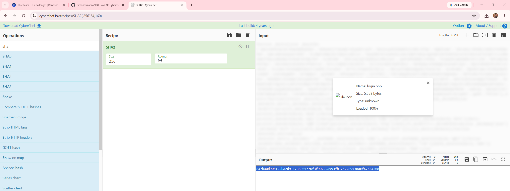

**Réponse : `847b4ad90b1daba2d9117a8e05776f3f902dda593fb1252289538acf476c4268`**

## Exécution

### Q4 — Processus ayant exécuté le fichier

Le fichier est un `.js`, associé sous Windows au Windows Script Host. Le code lui-même le confirme : il utilise `WScript` et `ActiveXObject`, qui n'existent que hors navigateur. Un second indice réseau va dans le même sens : la requête vers `resources.dll` porte le User-Agent `Mozilla/4.0 (compatible; MSIE 7.0 … .NET4.0)`, signature de WinINet utilisée par `wscript.exe`, alors que `login.php` avait été récupéré par le navigateur (UA Chrome/Edge).

La confirmation directe vient de la threat intelligence. En cherchant le SHA-256 sur VirusTotal, l'onglet Behavior montre l'arbre de processus observé en sandbox.

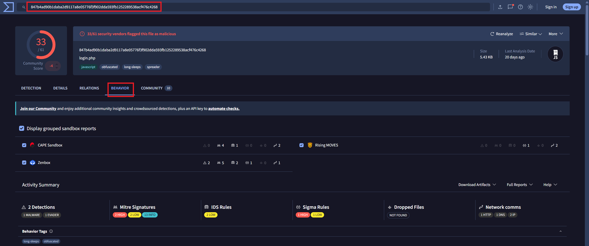

`Processes Created` liste `C:\Windows\system32\wscript.exe "…\708.js"`.

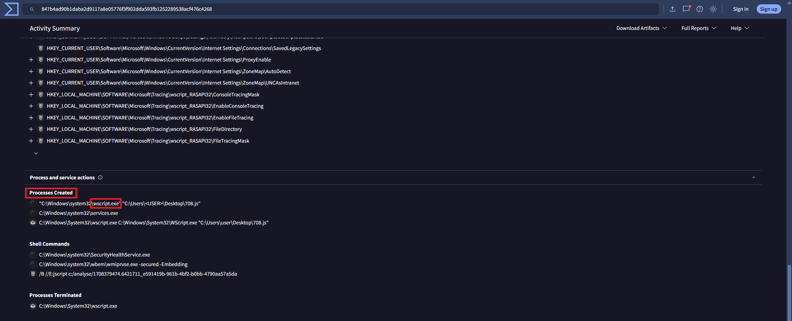

**Réponse : `wscript.exe`** — ATT&CK T1059.007 (JavaScript) + T1204.002 (User Execution: Malicious File).

## Second payload

### Q5 — Extension du second fichier malveillant

La liste Export Objects montre le second téléchargement : `resources.dll` (11 Mo) depuis `soundata.top`.

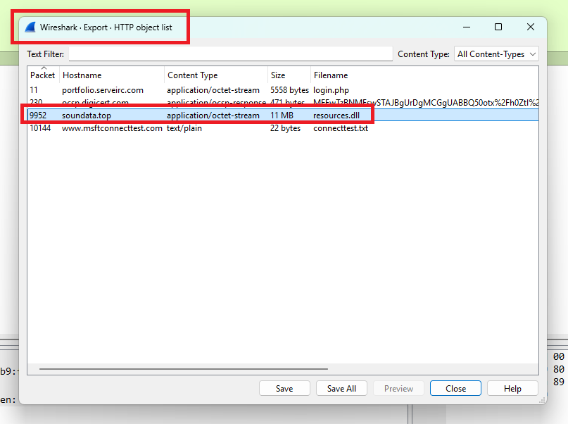

**Réponse : `dll`**

### Q6 — MD5 du second fichier

On sauvegarde `resources.dll` depuis Export Objects, puis on calcule son MD5.

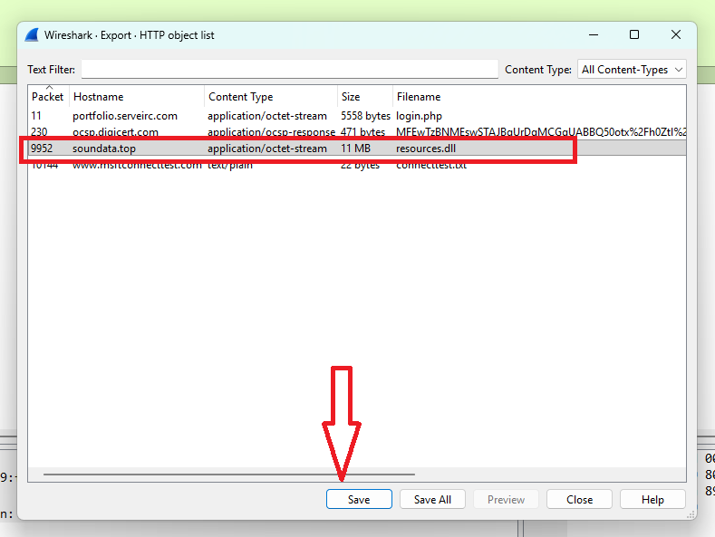
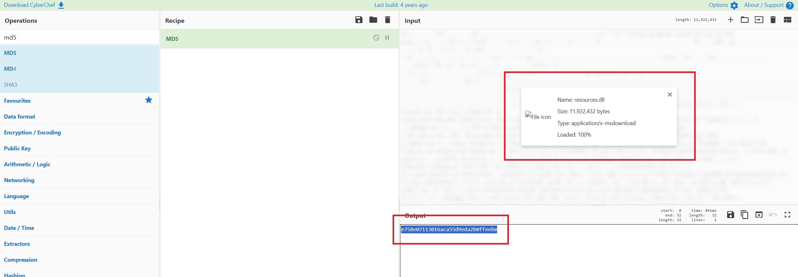

Version reproductible depuis le PCAP :

```powershell
& "C:\Program Files\Wireshark\tshark.exe" -r 205-DanaBot.pcap --export-objects "http,.\obj" -q
Get-FileHash .\obj\resources.dll -Algorithm MD5
```

**Réponse : `e758e07113016aca55d9eda2b0ffeebe`** — ATT&CK T1105 (Ingress Tool Transfer).

## Récapitulatif

| Q | Élément | Réponse |
|---|---|---|
| 1 | IP de l'accès initial | `62.173.142.148` |
| 2 | Fichier d'accès initial | `allegato_708.js` |
| 3 | SHA-256 du fichier | `847b4ad90b1daba2d9117a8e05776f3f902dda593fb1252289538acf476c4268` |
| 4 | Processus d'exécution | `wscript.exe` |
| 5 | Extension du 2ᵉ fichier | `dll` |
| 6 | MD5 du 2ᵉ fichier | `e758e07113016aca55d9eda2b0ffeebe` |

IOCs réseau : `62.173.142.148` (`portfolio.serveirc.com`, accès initial), `soundata.top` (second payload).

Mapping MITRE ATT&CK : T1071.001 (Web Protocols), T1059.007 (JavaScript), T1204.002 (User Execution), T1105 (Ingress Tool Transfer).

## Ce que je retiens

Le cœur de l'enquête tient dans la lecture d'un seul flux HTTP : le Follow Stream a donné d'un coup le vrai nom du fichier (`allegato_708.js`), sa nature (JavaScript obfusqué) et l'indice du processus (`WScript`). Le reste n'était que l'application mécanique de la même chaîne — extraire, hasher, confirmer avec la threat intelligence. Le détail qui m'a marqué : le changement de User-Agent entre les deux téléchargements, qui trahit à lui seul le passage du navigateur à `wscript.exe`.

## Côté défense

- Bloquer l'exécution des `.js`/`.vbs` par double-clic (associer le Windows Script Host à un éditeur, ou le désactiver via GPO).
- Journaliser `wscript.exe`/`cscript.exe`, surtout lorsqu'ils établissent des connexions réseau.
- Bloquer les IOCs réseau (`62.173.142.148`, `soundata.top`) sur le proxy et le pare-feu.
- Sensibiliser les utilisateurs aux pièces jointes de type script (ici un faux « allegato » italien).
