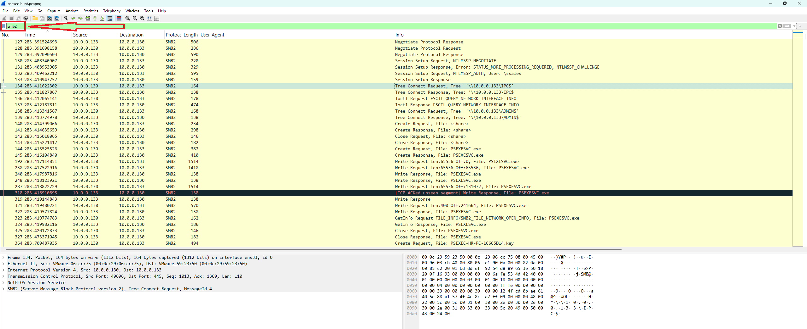
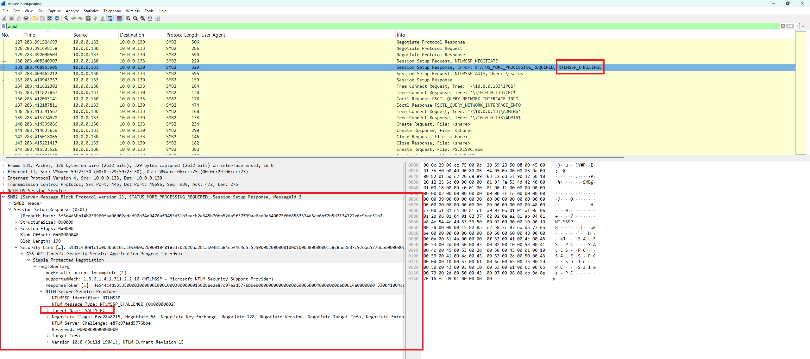
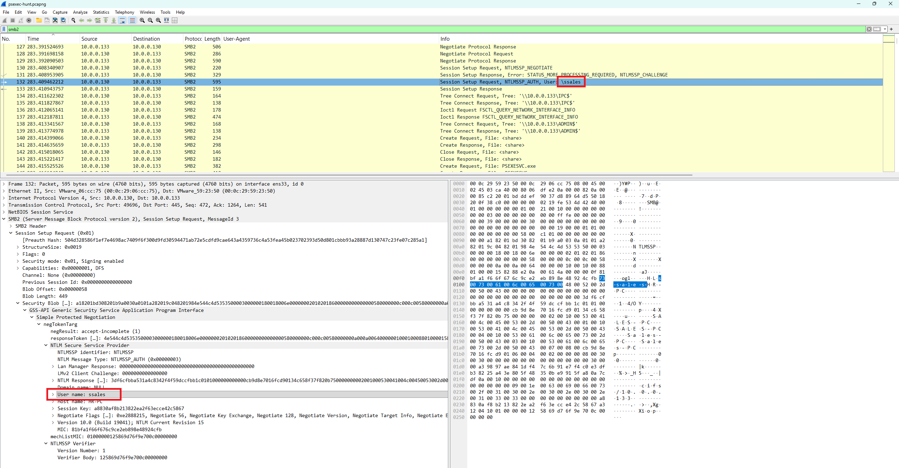
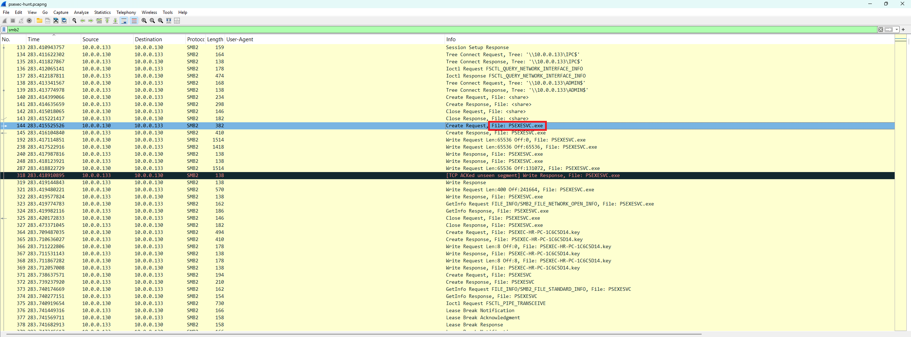
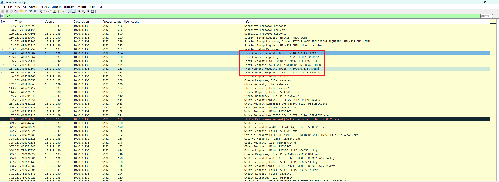
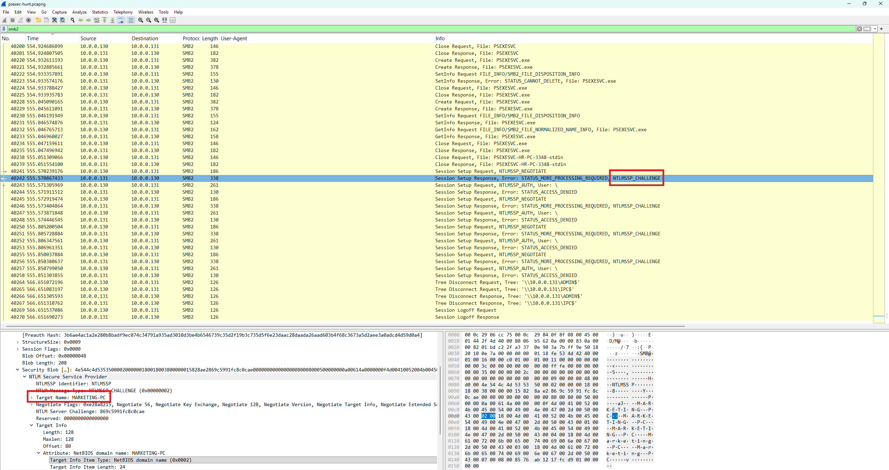

# Day 004 — PsExec Hunt Lab

| | |
|---|---|
| Plateforme | [CyberDefenders](https://cyberdefenders.org/blueteam-ctf-challenges/psexec-hunt/) |
| Catégorie | Network Forensics |
| Difficulté | Easy — Retired |
| Date | 2026-08-14 |
| Outils | Wireshark |

Lab retiré, donc les réponses sont incluses.

## Contexte

Une alerte IDS a signalé du mouvement latéral via PsExec. À partir d'un seul PCAP (`psexec-hunt.pcapng`), il faut retracer le déplacement de l'attaquant : point d'entrée, machines ciblées, compte utilisé, ampleur de la compromission.

PsExec (Sysinternals) permet d'exécuter des commandes à distance, entièrement via SMB. Détourné par un attaquant, il sert de vecteur de mouvement latéral. Son fonctionnement en trois temps :

```
1. connexion à ADMIN$ pour DÉPOSER un exécutable de service (PSEXESVC.exe)
2. création et démarrage d'un service à distance via IPC$ (named pipe)
3. exécution des commandes via des pipes stdin/stdout/stderr
```

Toute l'analyse se fait dans le trafic SMB2 (filtre `smb2`).

## Distinguer client et serveur

En SMB, le client émet les « Request » et initie tout ; le serveur émet les « Response » et héberge les partages. Ici, `10.0.0.130` fait toutes les Request (Negotiate, Session Setup, Tree Connect, Create, Write) et se connecte à `\\10.0.0.133\ADMIN$`. C'est donc l'attaquant ; `10.0.0.133` est la cible.



### Q1 — IP de la machine d'où vient l'attaquant

C'est la machine qui initie la session PsExec, celle qui pousse le binaire vers le partage de l'autre.

**Réponse : `10.0.0.130`**

### Q2 — Hostname de la première machine pivotée

Une IP n'est pas un hostname. Le nom d'une machine est révélé pendant l'authentification NTLM : le serveur annonce son identité dans le message `NTLMSSP_CHALLENGE`. Dans le paquet 131 (Session Setup Response de `10.0.0.133`), le champ `Target Name` donne le nom.



**Réponse : `SALES-PC`** (la cible `10.0.0.133`).

### Q3 — Nom d'utilisateur utilisé pour l'authentification

À l'inverse, le message `NTLMSSP_AUTH` est envoyé par le client et contient l'identité de celui qui se connecte. Dans le paquet 132, `User name` révèle le compte.



**Réponse : `ssales`**

> Le même message expose aussi `Host name: HR-PC` : c'est le nom de la machine attaquante (`10.0.0.130`), confirmé par le fichier `PSEXEC-HR-PC-...key` créé plus loin.

## Mécanique de PsExec

### Q4 — Nom de l'exécutable de service déposé

Après s'être connecté aux partages, l'attaquant crée puis écrit un fichier sur la cible (une série de `Write Request` à offsets croissants = copie du binaire). Le `Create Request` du paquet 144 donne son nom.



**Réponse : `PSEXESVC.exe`** — ATT&CK T1570 (Lateral Tool Transfer), T1569.002 (Service Execution).

### Q5 et Q6 — Partages utilisés

PsExec utilise deux partages administratifs, chacun avec un rôle précis :

- `ADMIN$` (pointe vers `C:\Windows`) pour **déposer et installer** le service.
- `IPC$` pour **communiquer** avec le service via des named pipes.

Les deux Tree Connect sont visibles côte à côte (paquets 134 et 138).



**Réponse Q5 (installation) : `ADMIN$`**
**Réponse Q6 (communication) : `IPC$`** — ATT&CK T1021.002 (SMB/Windows Admin Shares).

## Second pivot

### Q7 — Hostname de la deuxième machine ciblée

Bien plus tard dans la capture (~555 s contre ~283 s pour la première attaque), la même machine `10.0.0.130` rejoue le scénario, cette fois contre `10.0.0.131`. Le `NTLMSSP_CHALLENGE` de cette nouvelle cible donne son nom. On note au passage une rafale de `STATUS_ACCESS_DENIED` : des tentatives d'authentification échouées avant l'accès.



**Réponse : `MARKETING-PC`** (la cible `10.0.0.131`).

## Récapitulatif

| Q | Élément | Réponse |
|---|---|---|
| 1 | IP de l'attaquant | `10.0.0.130` |
| 2 | 1ʳᵉ machine pivotée | `SALES-PC` |
| 3 | Compte utilisé | `ssales` |
| 4 | Exécutable de service | `PSEXESVC.exe` |
| 5 | Partage d'installation | `ADMIN$` |
| 6 | Partage de communication | `IPC$` |
| 7 | 2ᵉ machine pivotée | `MARKETING-PC` |

Vue d'ensemble de l'intrusion :

```
HR-PC (10.0.0.130)  --PsExec-->  SALES-PC (10.0.0.133)      [~283 s]
        \--------- --PsExec-->  MARKETING-PC (10.0.0.131)   [~555 s]
```

Mapping MITRE ATT&CK : T1021.002 (SMB/Admin Shares), T1570 (Lateral Tool Transfer), T1569.002 (Service Execution), T1078 (Valid Accounts).

## Ce que je retiens

Tout PsExec tient dans deux idées : deux partages aux rôles distincts (ADMIN$ pour poser le binaire, IPC$ pour le piloter), et le protocole NTLM qui trahit les identités selon le sens du message — le CHALLENGE (serveur) donne le nom de la cible, l'AUTH (client) donne le compte et le nom de l'attaquant. Une fois ces deux repères en tête, lire la liste SMB2 suffit à reconstituer toute l'attaque, y compris le second pivot en suivant simplement la chronologie.

## Côté défense

- Alerter sur la présence de `PSEXESVC.exe` dans `ADMIN$` et sur les named pipes `PSEXESVC-*-stdin/stdout/stderr` : signature réseau quasi sans faux positif.
- Traiter tout accès à `ADMIN$`/`IPC$` entre deux postes clients comme suspect (segmenter, restreindre les partages admin).
- Corréler les rafales de `STATUS_ACCESS_DENIED` avec les Event ID 4625, et les créations de service avec l'Event ID 7045.
