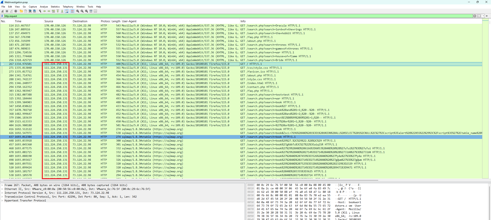
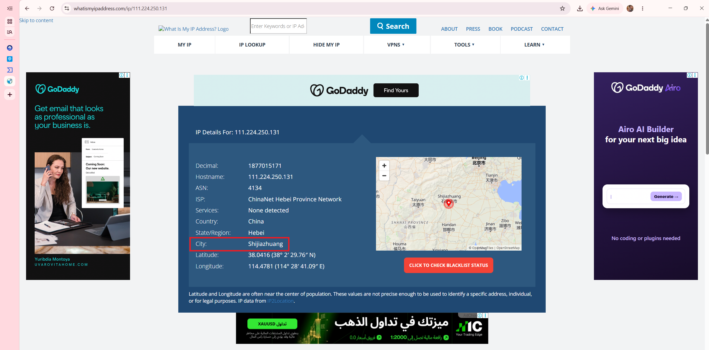
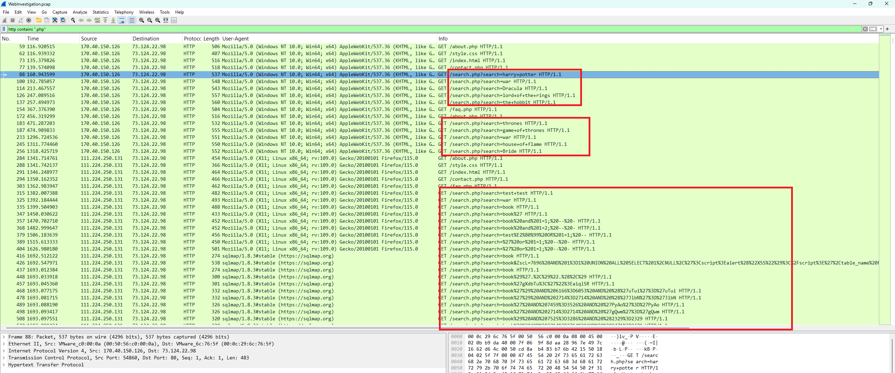
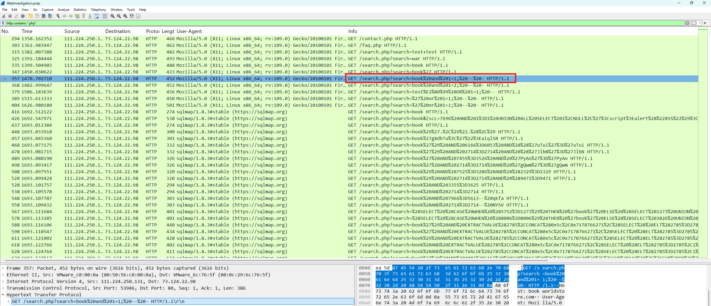
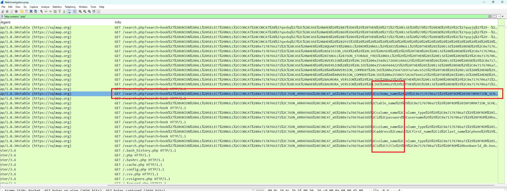
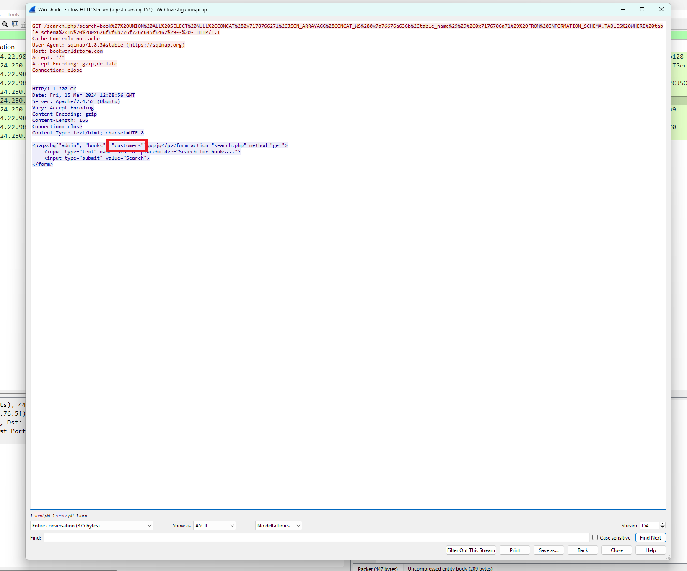
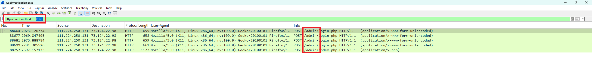
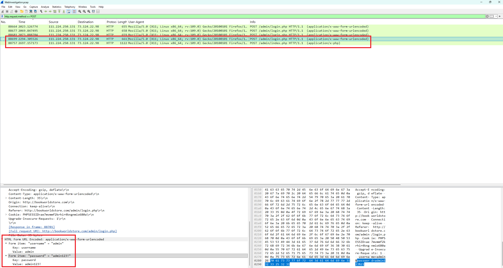
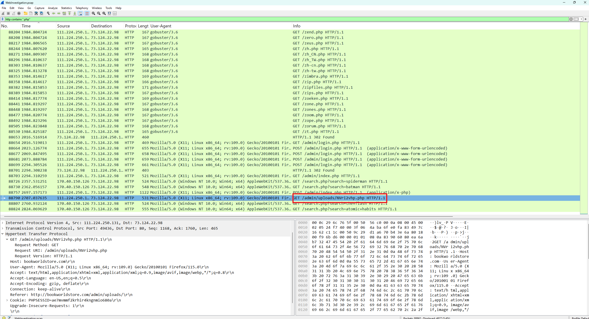

# Day 005 — Web Investigation Lab

| | |
|---|---|
| Plateforme | [CyberDefenders](https://cyberdefenders.org/blueteam-ctf-challenges/web-investigation/) |
| Catégorie | Network Forensics |
| Difficulté | Easy — Retired |
| Date | 2026-08-14 |
| Outils | Wireshark, NetworkMiner, CyberChef |

Lab retiré, donc les réponses sont incluses.

## Contexte

Analyste SOC chez **BookWorld** (librairie en ligne), une alerte signale un pic anormal de requêtes en base de données. À partir d'un seul PCAP (`WebInvestigation.pcap`), il faut déterminer le vecteur d'attaque, l'ampleur de la fuite, et si l'attaquant a obtenu un accès plus profond.

L'attaque suit une progression classique de compromission web :

```
reconnaissance  ->  injection SQL manuelle puis sqlmap  ->  dump des bases et tables
   ->  découverte du répertoire /admin/ (gobuster)  ->  login administrateur
   ->  upload d'un web-shell
```

Tout passe par HTTP : le filtre de base est `http.request`, et beaucoup d'URL sont encodées (à décoder avec CyberChef).

## Identifier l'attaquant

### Q1 — IP de l'attaquant

Deux IP sources apparaissent dans le trafic HTTP : `170.40.150.126` (Windows, recherches légitimes comme *Dracula*, *the hobbit*) et `111.224.250.131` (Linux/Firefox, puis User-Agent **sqlmap**). L'activité malveillante vient de la seconde.



**Réponse : `111.224.250.131`**

### Q2 — Ville d'origine

Une recherche de géolocalisation sur l'IP (whatismyipaddress / ipinfo) situe l'attaquant en Chine, province du Hebei.



**Réponse : `Shijiazhuang`**

## L'injection SQL

### Q3 — Script PHP vulnérable

Toutes les injections ciblent le paramètre `search` d'un même script : `/search.php?search=…`. C'est le point d'entrée vulnérable.



**Réponse : `search.php`** — ATT&CK T1190 (Exploit Public-Facing Application).

### Q4 — Première tentative de SQLi (URI décodée)

Avant sqlmap, l'attaquant teste manuellement l'injection. La première tentative, encodée `book%20and%201=1;%20--%20-`, se décode simplement.



**Réponse (décodée) : `/search.php?search=book and 1=1; -- -`**

### Q5 — Requête listant les bases de données (URI décodée)

Une fois l'injection confirmée, sqlmap interroge `INFORMATION_SCHEMA` pour énumérer les **bases** (via `schema_name`).



**Réponse (décodée) :**
```
/search.php?search=book' UNION ALL SELECT NULL,CONCAT(0x7178766271,JSON_ARRAYAGG(CONCAT_WS(0x7a76676a636b,schema_name)),0x7176706a71) FROM INFORMATION_SCHEMA.SCHEMATA-- -
```

### Q6 — Table contenant les données utilisateurs

En suivant le flux HTTP de la requête qui énumère les tables, la réponse du serveur renvoie la liste : `["admin", "books", "customers"]`. La table des utilisateurs du site est `customers`.



**Réponse : `customers`**

## Accès administrateur et web-shell

### Q7 — Répertoire découvert par l'attaquant

Après le dump de la base, l'attaquant lance gobuster (User-Agent `gobuster/3.6`) pour énumérer les répertoires, puis se dirige vers `/admin/`.



**Réponse : `admin`**

### Q8 — Identifiants utilisés pour se connecter

Le `POST /admin/login.php` contient le formulaire d'authentification en clair : `username=admin`, `password=admin123!`.



**Réponse : `admin:admin123!`** — ATT&CK T1078 (Valid Accounts).

### Q9 — Script malveillant uploadé

Une fois connecté, l'attaquant dépose un web-shell dans `/admin/uploads/`, visible par la requête `GET /admin/uploads/NVri2vhp.php`.



**Réponse : `NVri2vhp.php`** — ATT&CK T1505.003 (Web Shell).

## Récapitulatif

| Q | Élément | Réponse |
|---|---|---|
| 1 | IP de l'attaquant | `111.224.250.131` |
| 2 | Ville d'origine | `Shijiazhuang` |
| 3 | Script vulnérable | `search.php` |
| 4 | 1ʳᵉ SQLi (décodée) | `/search.php?search=book and 1=1; -- -` |
| 5 | Requête bases (décodée) | `... schema_name ... FROM INFORMATION_SCHEMA.SCHEMATA-- -` |
| 6 | Table utilisateurs | `customers` |
| 7 | Répertoire découvert | `admin` |
| 8 | Identifiants | `admin:admin123!` |
| 9 | Web-shell uploadé | `NVri2vhp.php` |

Mapping MITRE ATT&CK : T1190 (Exploit Public-Facing Application), T1078 (Valid Accounts), T1505.003 (Web Shell).

## Ce que je retiens

Le fil rouge du lab, c'est la lecture des URL : les tentatives d'injection sont visibles telles quelles dans `http.request`, mais leur sens n'apparaît qu'une fois décodées. La différence entre bruit et attaque tient au User-Agent — un vrai navigateur qui cherche *Dracula*, puis `sqlmap` et `gobuster` qui trahissent l'outillage offensif. Et pour la donnée exfiltrée (la table `customers`), ce n'est pas la requête qui la révèle mais la réponse du serveur, qu'on ne voit qu'en suivant le flux.

## Côté défense

- Utiliser des requêtes préparées (requêtes paramétrées) pour éliminer l'injection SQL à la racine.
- Alerter sur les User-Agent d'outils offensifs (`sqlmap`, `gobuster`) et sur les rafales de requêtes vers un même endpoint.
- Restreindre l'accès à `/admin/` (authentification forte, filtrage IP) et interdire l'exécution de fichiers dans les répertoires d'upload.
- Surveiller la création de fichiers `.php` dans `/uploads/`.
