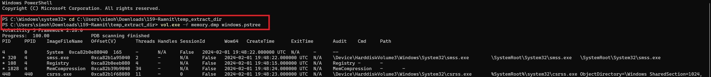
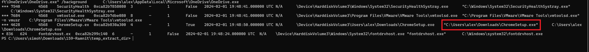
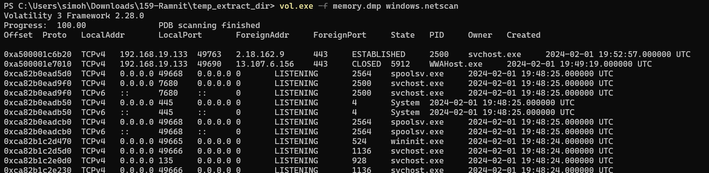
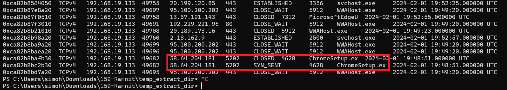
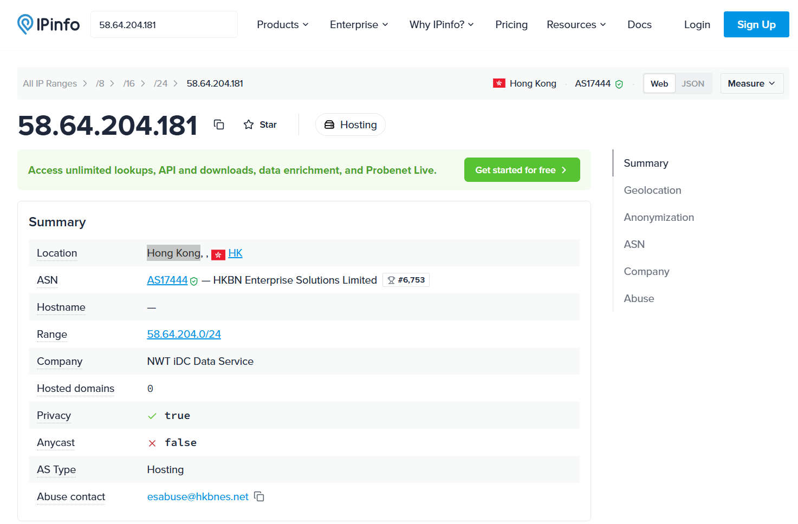
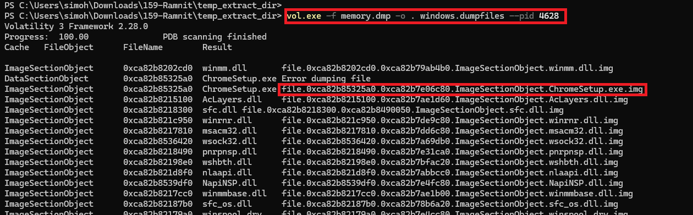
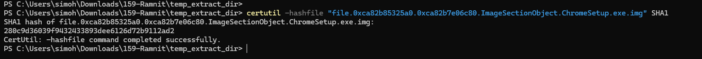
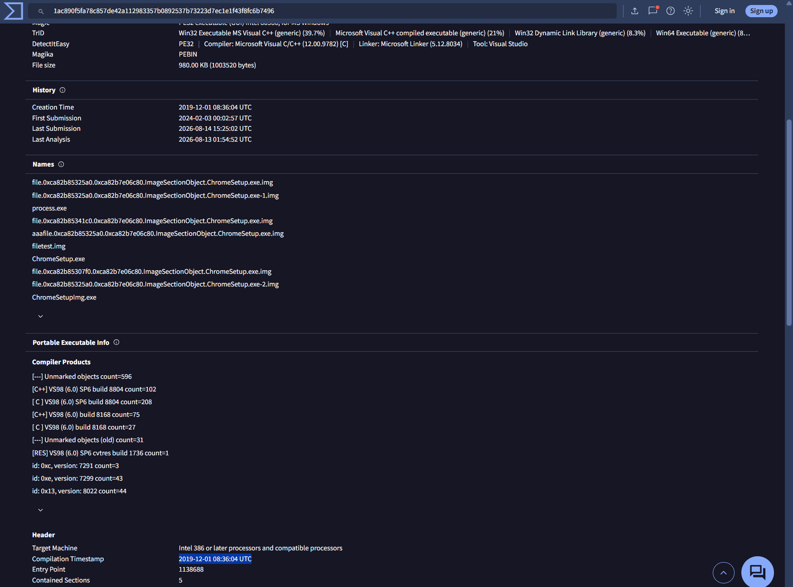

# Day 007 — Ramnit Lab

| | |
|---|---|
| Plateforme | [CyberDefenders](https://cyberdefenders.org/blueteam-ctf-challenges/ramnit/) |
| Catégorie | Endpoint Forensics |
| Difficulté | Easy — Retired |
| Date | 2026-08-16 |
| Outils | Volatility 3, certutil, VirusTotal, IPinfo |

Lab retiré, donc les réponses sont incluses.

## Contexte

L'IDS a signalé un comportement suspect sur un poste de travail, vraisemblablement une infection. Un **dump mémoire** (`memory.dmp`) de la machine a été capturé. Objectif : analyser cette RAM figée, retrouver le processus malveillant, tracer ses actions réseau et sortir les IOCs (hash, IP, domaine).

Ramnit est un ver bancaire connu (vol d'identifiants, backdoor, propagation). Mais tout doit venir de ce qu'on observe **dans le dump** — pas de connaissances a priori.

## Méthode

Le fil d'une investigation mémoire va du général au précis : identifier le système, lister les processus, repérer l'anomalie, puis pivoter vers le réseau et le fichier lui-même.

```
windows.info      ->  identifier l'OS pour que Volatility sache lire le dump
windows.pstree    ->  arborescence des processus, repérer l'intrus
windows.netscan   ->  connexions réseau du processus suspect (C2)
windows.dumpfiles ->  extraire le binaire de la mémoire
certutil + VirusTotal  ->  hash, timestamp de compilation, domaines
```

## Identifier le processus

Avant tout, `windows.info` confirme le profil du système (Windows 10 x64) pour que le reste des plugins fonctionne. Puis on liste l'arborescence des processus.

```bash
vol.exe -f memory.dmp windows.pstree
```



### Q1 — Processus responsable de l'activité suspecte

En bas de l'arborescence, un processus détonne : `ChromeSetup.exe` (PID 4628), lancé depuis le dossier `Downloads` de l'utilisateur `alex`. Un installateur Chrome légitime est signé et éphémère — celui-ci reste actif et se comportera comme un malware (voir réseau plus bas).



**Réponse : `ChromeSetup.exe`**

### Q2 — Chemin complet de l'exécutable

La colonne `Path` du `pstree` donne l'emplacement exact du binaire.

**Réponse : `C:\Users\alex\Downloads\ChromeSetup.exe`** — ATT&CK T1204.002 (User Execution: Malicious File).

## Tracer le réseau

```bash
vol.exe -f memory.dmp windows.netscan
```



### Q3 — IP contactée par le malware

En filtrant sur le PID 4628, on trouve deux lignes vers la **même IP** : une en `SYN_SENT`, une en `CLOSED`, sur le port **5202**. C'est la tentative de connexion au serveur de commande et contrôle (C2). Le port non standard 5202 est un signal fort : un vrai ChromeSetup parlerait à Google en 443.



**Réponse : `58.64.204.181`** — ATT&CK T1071 (Application Layer Protocol), T1571 (Non-Standard Port).

### Q4 — Ville associée à l'IP

Une recherche de géolocalisation (IPinfo) situe l'IP à Hong Kong, hébergée chez HKBN (AS17444, type *Hosting*).



**Réponse : `Hong Kong`**

## Analyser le binaire

### Q5 — Hash SHA1 de l'exécutable

On extrait le binaire de la mémoire avec `windows.dumpfiles`, ciblé sur le PID du malware.

```bash
vol.exe -f memory.dmp -o . windows.dumpfiles --pid 4628
```



Deux caches sont proposés : `DataSectionObject` (le fichier disque) échoue ici, seule l'image mémoire `ImageSectionObject` est extraite (`file.0x...ImageSectionObject.ChromeSetup.exe.img`). On la hashe :

```bash
certutil -hashfile "file.0xca82b85325a0.0xca82b7e06c80.ImageSectionObject.ChromeSetup.exe.img" SHA1
```



**Réponse : `280c9d36039f9432433893dee6126d72b9112ad2`**

> Point important : ce hash provient de l'image **mémoire** (relocations, padding), pas du fichier disque d'origine. Il ne correspond donc pas forcément au SHA1 d'un `.exe` téléchargé. Ici, d'autres analystes ont soumis exactement ce même carving à VirusTotal, qui le reconnaît (SHA256 `1ac890f5...b7496`). Dans un cas réel où VT ne reconnaît pas le hash mémoire, il faudrait pivoter par l'IP ou le domaine.

### Q6 — Timestamp de compilation

Sur la page VirusTotal du fichier, onglet *Details* → *Portable Executable Info* → *Header*, le champ **Compilation Timestamp** donne la date de build.



**Réponse : `2019-12-01 08:36:04`**

### Q7 — Domaine lié au malware

Onglet *Relations* de VirusTotal, section *Contacted Domains*. Quatre domaines apparaissent : deux légitimes Microsoft (0 détection) et deux malveillants — `dnsnb8.net` et son sous-domaine `ddos.dnsnb8.net` (15-17 moteurs). Le domaine au sens strict (second niveau) est `dnsnb8.net`. Les *Contacted URLs* (`http://ddos.dnsnb8.net:799/cj/k1.rar` …) montrent comment Ramnit télécharge ses modules.

**Réponse : `dnsnb8.net`** — ATT&CK T1071.001 (Web Protocols), T1105 (Ingress Tool Transfer).

## Récapitulatif

| Q | Élément | Réponse |
|---|---|---|
| 1 | Processus responsable | `ChromeSetup.exe` |
| 2 | Chemin de l'exécutable | `C:\Users\alex\Downloads\ChromeSetup.exe` |
| 3 | IP contactée | `58.64.204.181` |
| 4 | Ville de l'IP | `Hong Kong` |
| 5 | SHA1 de l'exécutable | `280c9d36039f9432433893dee6126d72b9112ad2` |
| 6 | Timestamp de compilation | `2019-12-01 08:36:04` |
| 7 | Domaine lié au malware | `dnsnb8.net` |

Chaîne complète :

```
"ChromeSetup.exe" (faux) exécuté depuis C:\Users\alex\Downloads
   ->  tente une connexion C2 vers 58.64.204.181:5202 (Hong Kong, port non standard)
   ->  Ramnit compilé le 2019-12-01, contacte dnsnb8.net
   ->  télécharge ses modules (.rar) depuis ddos.dnsnb8.net:799
```

Mapping MITRE ATT&CK : T1204.002 (User Execution), T1071 / T1071.001 (Application Layer Protocol / Web Protocols), T1571 (Non-Standard Port), T1105 (Ingress Tool Transfer).

## Ce que je retiens

La logique d'un dump mémoire tient dans un ordre : identifier le système avant de lire quoi que ce soit, puis descendre du processus vers le réseau vers le fichier. L'anomalie du `pstree` (un « installateur » qui vit sa vie dans `Downloads`) ne devient une certitude qu'avec le `netscan` : c'est la connexion vers Hong Kong sur un port bizarre qui transforme le soupçon en preuve. Le piège du lab est le SHA1 : un hash tiré de la mémoire n'est pas celui du fichier disque — utile à savoir avant de le comparer à une base externe.

## Côté défense

- Bloquer sur le proxy/DNS le domaine `dnsnb8.net` et l'IP `58.64.204.181`.
- Alerter sur les exécutables lancés depuis les dossiers `Downloads` / `Temp` des utilisateurs, surtout ceux qui ouvrent des connexions sortantes sur des ports non standard.
- Se méfier des faux installateurs de logiciels connus (ChromeSetup, AdobeSetup…) : vérifier la signature numérique avant exécution.
- Surveiller les téléchargements de modules `.rar`/`.dat` depuis des domaines à faible réputation.
