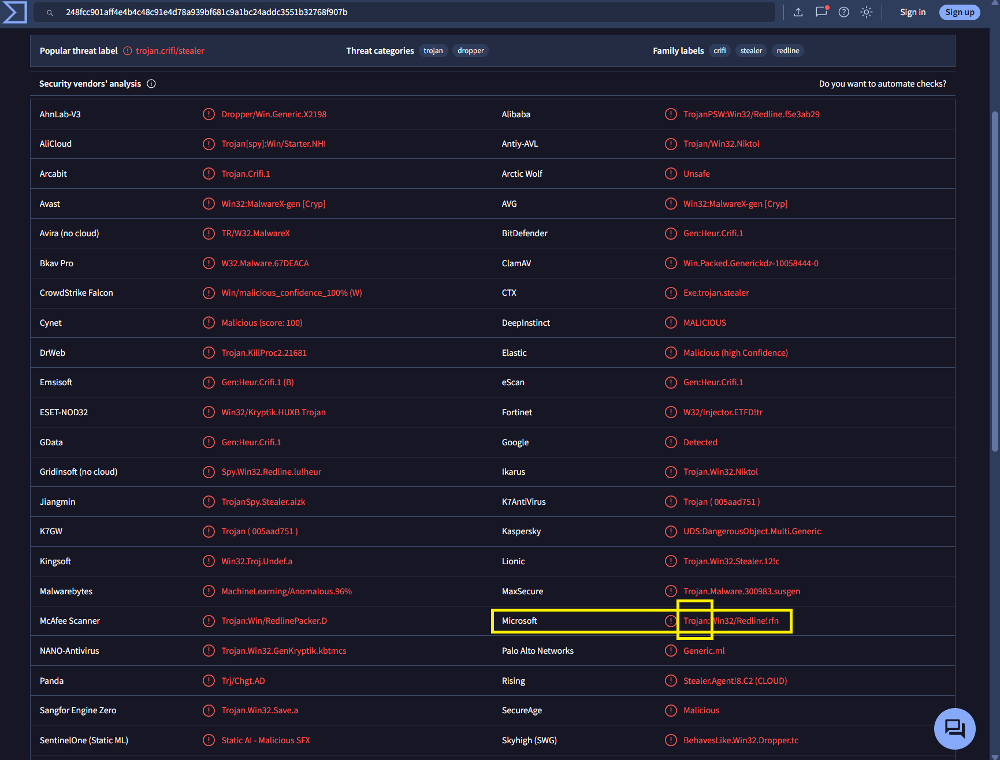
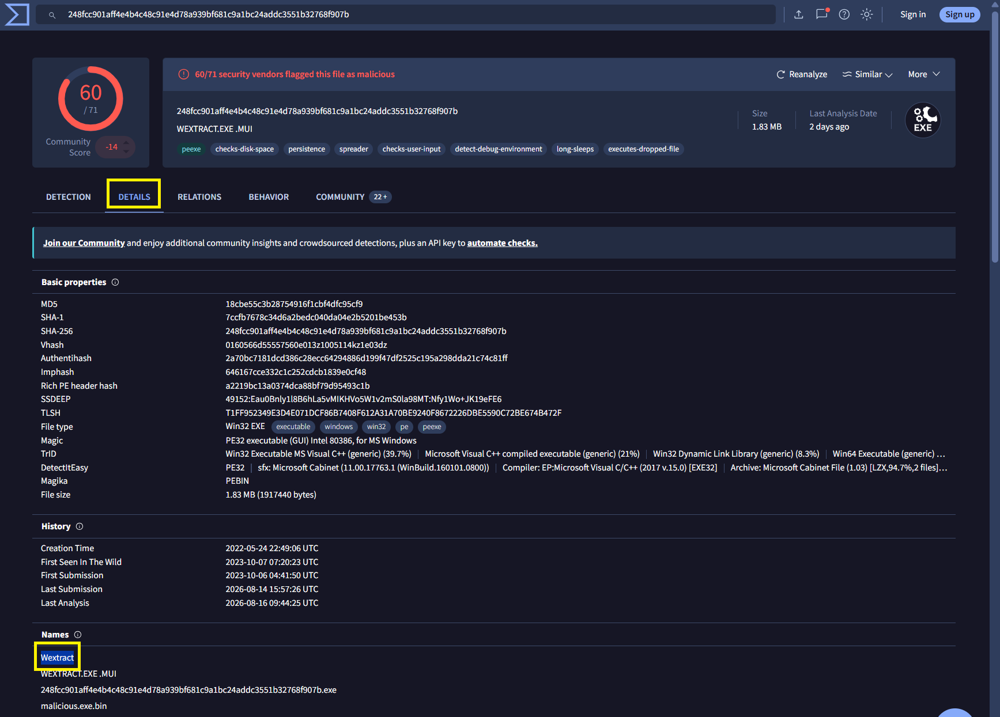
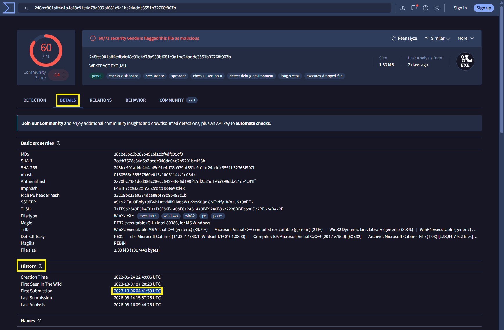
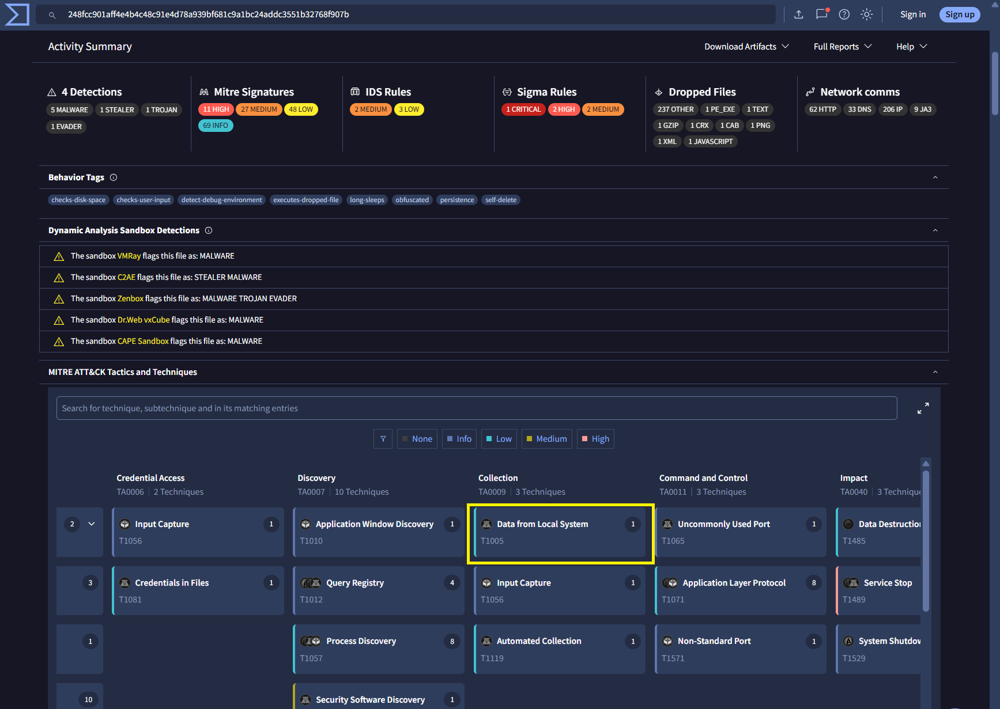
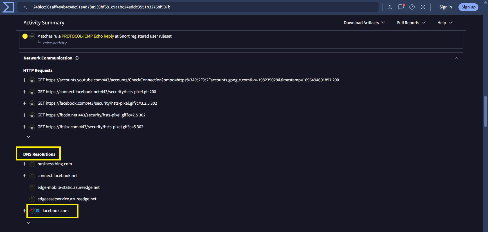
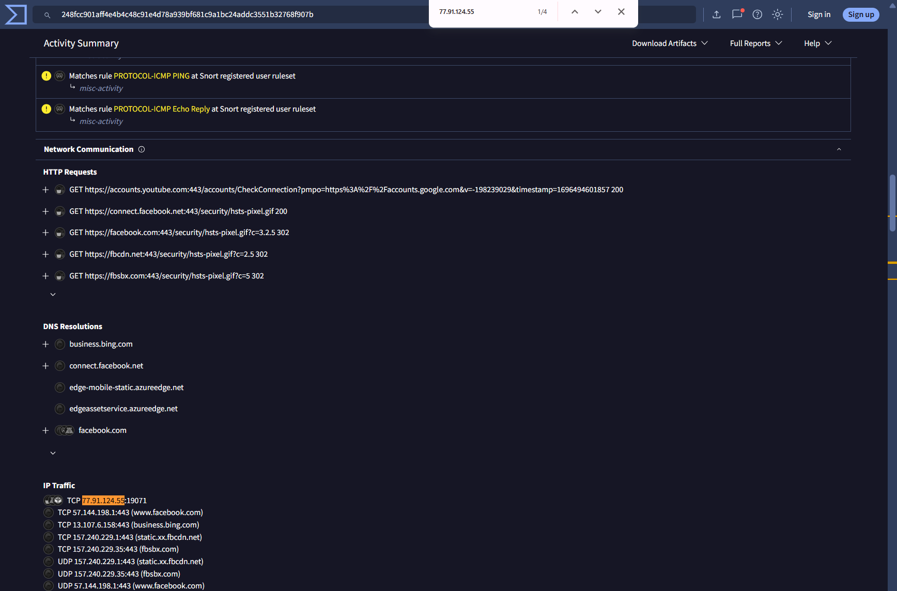
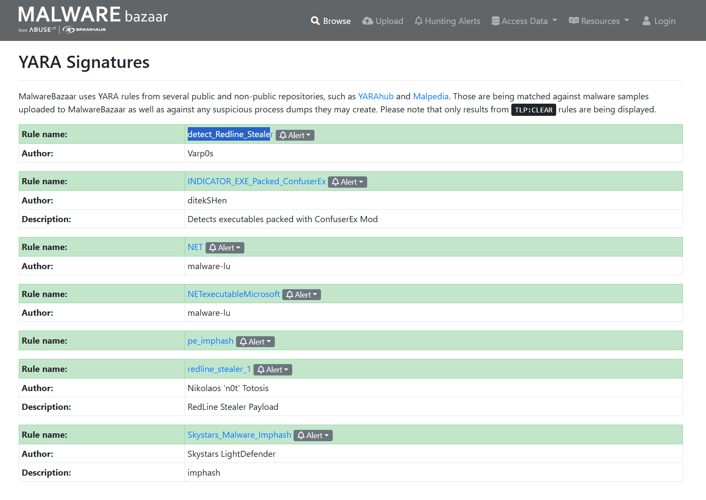
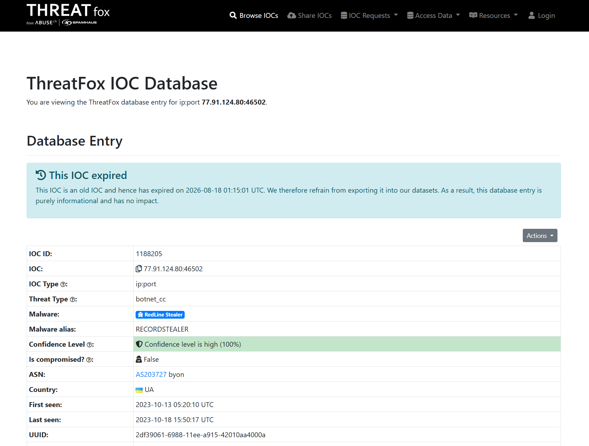
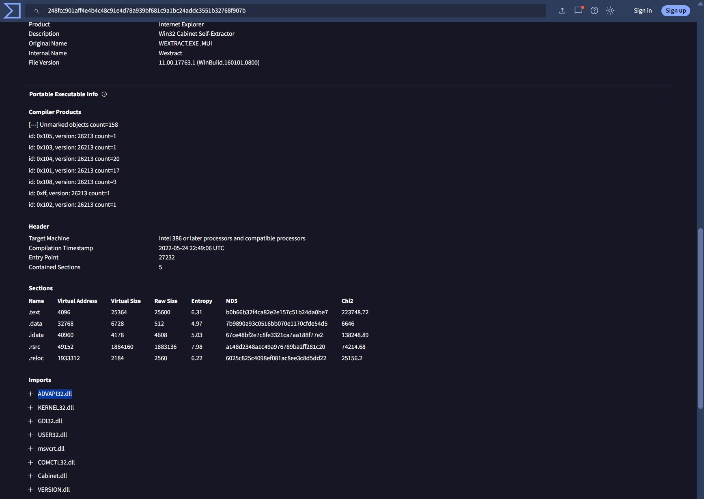

# Day 010 — Red Stealer Lab

| | |
|---|---|
| Plateforme | [CyberDefenders](https://cyberdefenders.org/blueteam-ctf-challenges/red-stealer/) |
| Catégorie | Threat Intelligence |
| Difficulté | Easy — Retired |
| Date | 2026-08-18 |
| Outils | VirusTotal, MalwareBazaar, ThreatFox, ANY.RUN, Whois |

Lab retiré, donc les réponses sont incluses.

## Contexte

Équipe Threat Intelligence d'un SOC : un exécutable suspect a été trouvé sur le poste d'un collègue, soupçonné d'être relié à un serveur C2. À partir de son **hash**, il faut extraire un maximum d'informations (IOCs, infrastructure C2, techniques MITRE, mécanismes) pour aider l'équipe Incident Response à réagir.

Comme le Day-009, c'est du **pivot de renseignement** : on ne dissèque rien localement, on interroge des bases publiques qui ont déjà analysé cet échantillon.

Hash de départ (SHA-256) :

```
248fcc901aff4e4b4c48c91e4d78a939bf681c9a1bc24addc3551b32768f907b
```

## Méthode

```
hash  ->  VirusTotal (Detection)   : catégorie Microsoft        (Q1)
      ->  VirusTotal (Details)     : nom du fichier + 1ʳᵉ soumission  (Q2, Q3)
      ->  VirusTotal (Behavior)    : MITRE Collection + DNS + IP:port (Q4, Q5, Q6)
      ->  MalwareBazaar            : règle YARA de Varp0s        (Q7)
      ->  ThreatFox                : alias de la famille via l'IP (Q8)
      ->  VirusTotal (Details/Imports) : DLL d'escalade          (Q9)
```

## Identité du fichier

### Q1 — Catégorie attribuée par Microsoft

Onglet *Detection*. On repère la ligne **Microsoft** : `Trojan:Win32/Redline!rfn`. Le premier segment d'un nom de détection est la catégorie.



**Réponse : `Trojan`**

### Q2 — Nom du fichier

Onglet *Details* → section *Names*. Parmi les noms, le nom interne significatif est `Wextract` (l'exécutable se déguise en `WEXTRACT.EXE`, un self-extractor Windows légitime — technique de masquerading). Sans extension :



**Réponse : `Wextract`**

### Q3 — Timestamp UTC de la première soumission

Onglet *Details* → section *History* → champ **First Submission** (à ne pas confondre avec *Creation Time*, falsifiable).



**Réponse : `2023-10-06 04:41:50`**

## Comportement et techniques

### Q4 — Technique MITRE de collecte de données locales

Onglet *Behavior* → *MITRE ATT&CK Tactics and Techniques*. Sous la tactique **Collection**, la technique qui décrit la collecte sur le système local est *Data from Local System*.



**Réponse : `T1005`**

### Q5 — Domaine du connectivity check

Onglet *Behavior* → *DNS Resolutions*. Avant de contacter son C2, le malware résout un domaine de réseau social connu pour vérifier qu'il a Internet (fiabilité + évasion sandbox). Parmi les domaines résolus, l'intrus légitime est `facebook.com` (visible aussi dans les HTTP Requests : `GET https://facebook.com/.../hsts-pixel.gif`).



**Réponse : `facebook.com`**

### Q6 — IP + port de destination du C2

Onglet *Behavior* → section *IP Traffic*. Toutes les autres connexions vont vers des services légitimes (Facebook, Bing, Azure sur le port 443). Une seule ligne détonne : une IP flaggée malveillante (17/91 dans *Relations → Contacted IPs*) sur un port haut non standard.



**Réponse : `77.91.124.55:19071`** — ATT&CK T1571 (Non-Standard Port), T1071 (Application Layer Protocol).

## Attribution et signatures communautaires

### Q7 — Règle YARA créée par Varp0s

Sur MalwareBazaar (recherche par hash) → section *YARA Signatures*. Plusieurs règles matchent ; celle dont l'auteur est **Varp0s** est `detect_Redline_Stealer`.



**Réponse : `detect_Redline_Stealer`**

### Q8 — Alias de la famille selon ThreatFox

Sur ThreatFox, en recherchant l'IP C2 de l'infrastructure, l'entrée pointe vers la famille **RedLine Stealer**, avec pour *Malware alias* `RECORDSTEALER`.



**Réponse : `RECORDSTEALER`**

## Mécanisme technique

### Q9 — DLL importée pour l'escalade de privilèges

Onglet *Details* → *Portable Executable Info* → *Imports*. Parmi les DLL importées (`KERNEL32`, `GDI32`, `USER32`…), celle dédiée à la sécurité / gestion des tokens et privilèges est `ADVAPI32.dll` (elle expose `AdjustTokenPrivileges`, `OpenProcessToken`…).



**Réponse : `ADVAPI32.dll`** — ATT&CK T1134 (Access Token Manipulation).

## Récapitulatif

| Q | Élément | Réponse |
|---|---|---|
| 1 | Catégorie Microsoft | `Trojan` |
| 2 | Nom du fichier | `Wextract` |
| 3 | 1ʳᵉ soumission (UTC) | `2023-10-06 04:41:50` |
| 4 | Technique MITRE (collecte) | `T1005` |
| 5 | Domaine connectivity check | `facebook.com` |
| 6 | C2 (IP:port) | `77.91.124.55:19071` |
| 7 | Règle YARA (Varp0s) | `detect_Redline_Stealer` |
| 8 | Alias de la famille | `RECORDSTEALER` |
| 9 | DLL d'escalade de privilèges | `ADVAPI32.dll` |

Profil de la menace :

```
Wextract.exe (faux self-extractor Windows, catégorie Trojan)
   ->  connectivity check sur facebook.com
   ->  collecte de données locales (T1005), C2 = 77.91.124.55:19071
   ->  famille RedLine Stealer (alias RECORDSTEALER)
   ->  escalade de privilèges via ADVAPI32.dll ; détecté par YARA detect_Redline_Stealer
```

Mapping MITRE ATT&CK : T1005 (Data from Local System), T1571 (Non-Standard Port), T1071 (Application Layer Protocol), T1134 (Access Token Manipulation), T1036 (Masquerading — se fait passer pour WEXTRACT.EXE).

## Ce que je retiens

Un dossier de threat intel se construit en croisant des sources spécialisées, chacune avec son rôle : **VirusTotal** pour l'identité, le comportement et les imports ; **MalwareBazaar** pour les signatures YARA ; **ThreatFox** pour relier une IP à une famille et ses alias. Deux réflexes clés vus ici : reconnaître le *connectivity check* (le domaine légitime au milieu du trafic malveillant), et traduire une capacité en artefact technique (escalade de privilèges → `ADVAPI32.dll`). Et toujours la question des alias : RedLine = RECORDSTEALER, un même code sous deux noms selon la source.

## Côté défense

- Déployer la règle YARA `detect_Redline_Stealer` sur le parc pour chasser d'autres instances.
- Bloquer le C2 `77.91.124.55:19071` sur le pare-feu (IP + port).
- Se méfier des exécutables usurpant des noms Windows légitimes (`WEXTRACT.EXE`) : vérifier la signature.
- Surveiller les processus Office/inconnus qui importent `ADVAPI32.dll` et manipulent des tokens, ainsi que les *connectivity checks* suivis d'une connexion sur port non standard.
